# Exercises: predicting IBD from the gut microbiome

## Before you start

These exercises use stool shotgun-metagenomics data from an inflammatory bowel disease (IBD) case-control study reported by [Nielsen et al. (2014)](https://doi.org/10.1038/nbt.2939). The processed abundance table was derived from the Bioconductor resource [`curatedMetagenomicData`](https://bioconductor.org/packages/curatedMetagenomicData/). You do not need Bioconductor for these exercises.

**Choose either R or Python and follow that language for the entire chapter.** The two tracks answer the same scientific questions, but R and Python use different random-number generators. Even with the same seed, they therefore select different samples and cross-validation folds. Small numerical differences between tracks are expected and do not change the interpretation.

The five exercises are **sequential and must be completed in order**. Each exercise names the objects that later exercises reuse. Start from a clean R session or Python kernel, run the setup once, and keep the resulting objects until the end of Exercise 5.

The workflow separates the data into three parts:

- a **training set** used to fit models and run cross-validation
- a **validation set** used to compare the weighted and unweighted models and choose a classification threshold
- a **test set** kept hidden until Exercise 5 and used for the final evaluation

Do not inspect test outcomes or test performance before Exercise 5.

### Files and folder structure

Download [ibd_microbiome.csv](data/ibd_microbiome.csv){download="ibd_microbiome.csv"} and save it in a folder named `data` beside your script or notebook:

``` text
your-project/
├── analysis.R          # or analysis.py / analysis.ipynb
└── data/
    └── ibd_microbiome.csv
```


`ibd_microbiome.csv` contains 396 rows and 608 columns:

- 606 microbial relative-abundance predictors, including 604 columns beginning with `species.` and two beginning with `genus.`
- `condition`, the binary outcome (`control` or `IBD`)
- `age`, a cohort annotation used only to check a possible group difference
- no supplied sample identifier and no plotting-only column. The setup creates `sample_id` from row order for alignment checks, but it must never be used as a predictor.

The abundance values are percentages. They are non-negative, contain no missing values, and sum to approximately 100 within each row. XGBoost does not require them to be scaled. `age` is missing for 12 samples. `condition` has no missing values.

If the download link opens the CSV in your browser, save the page as `ibd_microbiome.csv` without changing the filename. Run the code from `your-project/`, not from inside `data/`.

### Packages

Install packages once. Do not place installation commands inside a script that you run repeatedly.

::: panel-tabset
## R

``` r
install.packages(c("xgboost", "pROC"))
```

The exercises use `xgboost` for modeling and `pROC` for AUC. Data handling, the Welch t-test, and plotting use base R.

## Python

``` bash
python -m pip install numpy pandas xgboost matplotlib scikit-learn scipy
```

The exercises use `xgboost` for modeling, `scikit-learn` for AUC and confusion matrices, `scipy` for the Welch t-test, and `matplotlib` for plots.
:::

The displayed results were verified with R 4.5.3, `xgboost` 3.2.1.1, and `pROC` 1.19.1. The Python results were verified with Python 3.13.13, `xgboost` 3.4.1, `pandas` 3.0.6, `numpy` 2.5.3, `scikit-learn` 1.9.1, `scipy` 1.18.1, and `matplotlib` 3.11.2. Later package versions may produce small numerical differences.

### Setup

Run this setup once. It imports packages, loads the data, creates the outcome encoding, and defines one small helper used later. `binary_metrics()` takes predicted probabilities, true 0/1 labels, and a threshold. It returns sensitivity, specificity, balanced accuracy, and ordinary accuracy. IBD (`1`) is the positive class.

::: panel-tabset
## R

``` r
library(xgboost)
library(pROC)

microbiome <- read.csv("data/ibd_microbiome.csv", check.names = FALSE)
feature_cols <- setdiff(names(microbiome), c("age", "condition"))

x <- as.matrix(microbiome[, feature_cols])
condition <- microbiome$condition
age <- microbiome$age
sample_id <- seq_len(nrow(microbiome))
y_condition <- ifelse(condition == "IBD", 1, 0)

binary_metrics <- function(prob, truth, threshold) {
  pred <- ifelse(prob >= threshold, 1, 0)
  tp <- sum(pred == 1 & truth == 1)
  tn <- sum(pred == 0 & truth == 0)
  fp <- sum(pred == 1 & truth == 0)
  fn <- sum(pred == 0 & truth == 1)

  sensitivity <- tp / (tp + fn)
  specificity <- tn / (tn + fp)

  c(
    sensitivity = sensitivity,
    specificity = specificity,
    balanced_accuracy = mean(c(sensitivity, specificity)),
    accuracy = (tp + tn) / length(truth)
  )
}
```

## Python

``` python
import numpy as np
import pandas as pd
import xgboost as xgb
import matplotlib.pyplot as plt

from scipy import stats
from sklearn.metrics import confusion_matrix, roc_auc_score, roc_curve

microbiome = pd.read_csv("data/ibd_microbiome.csv")
feature_cols = [c for c in microbiome.columns if c not in ("age", "condition")]

x = microbiome[feature_cols].to_numpy(dtype=float)
condition = microbiome["condition"].to_numpy()
age = microbiome["age"].to_numpy()
sample_id = np.arange(1, len(microbiome) + 1)
y_condition = (condition == "IBD").astype(int)

def binary_metrics(prob, truth, threshold):
    """Return threshold metrics with IBD (1) as the positive class."""
    pred = (prob >= threshold).astype(int)
    tn, fp, fn, tp = confusion_matrix(truth, pred, labels=[0, 1]).ravel()
    sensitivity = tp / (tp + fn)
    specificity = tn / (tn + fp)
    return {
        "sensitivity": sensitivity,
        "specificity": specificity,
        "balanced_accuracy": (sensitivity + specificity) / 2,
        "accuracy": (tp + tn) / len(truth),
    }
```
:::

## Exercise 1. Audit the cohort and freeze the data split

Before fitting a model, make sure that every row, predictor, and outcome is where you expect it to be. A mistaken column or a shifted row order can give plausible-looking results that are completely wrong. This exercise also creates one fixed split that will be used throughout the chapter. Keeping the test set separate now prevents later choices from being influenced by the final answers.

**Task**

1. Verify that the table has 396 rows, 606 microbial predictors, one row identifier created from row order, and two non-predictor columns (`age` and `condition`). Confirm that the predictor matrix is 396 × 606, contains only finite non-negative values, and that its row sums are close to 100.
2. Report the control/IBD counts and the number of missing ages.
3. Treat `age` only as an annotation: report the mean age in each condition and use a Welch two-sample t-test plus a boxplot to compare the groups. Explain why a group difference could confound attempts to predict age from the microbiome in this case-control cohort.
4. Make a stratified 60%/20%/20% training/validation/test split with seed `1`. Verify class counts, absence of overlap, full coverage of all 396 rows, and outcome alignment.
5. Create `dtrain`, `dvalid`, and `dtest`. Keep all setup and split objects for later exercises. Do not inspect `y_condition[test_id]` beyond the displayed class-count check, and do not fit a model yet.

::: callout-tip
## Tip

Stratification means sampling separately within controls and IBD cases. The test class counts are shown only to verify the split. The test outcomes must not influence model selection, threshold selection, or tuning.
:::

::::: {.callout-note collapse="true"}
## Solution

::: panel-tabset
## R

``` r
dim(microbiome)
length(feature_cols)
c(species = sum(startsWith(feature_cols, "species.")),
  genus = sum(startsWith(feature_cols, "genus.")))
dim(x)

all(is.finite(x))
all(x >= 0)
range(rowSums(x))
identical(sample_id, seq_len(nrow(x)))

table(condition)
sum(is.na(age))

aggregate(age ~ condition, data = microbiome,
          FUN = function(z) c(n = length(z), mean = mean(z), sd = sd(z)))
age_test <- t.test(age ~ condition, data = microbiome)
age_test$p.value

boxplot(age ~ condition, data = microbiome,
        xlab = "Condition", ylab = "Age (years)",
        main = "Age distribution by condition")
```

``` text
[1] 396 608
[1] 606
species   genus
    604       2
[1] 396 606
[1] TRUE
[1] TRUE
[1]  97.04652 100.00006

control     IBD
    248     148
[1] 12

  condition     age.n  age.mean    age.sd
1   control 236.00000  52.08898  11.90800
2       IBD 148.00000  41.22297  11.15373
[1] 1.295753e-17
```

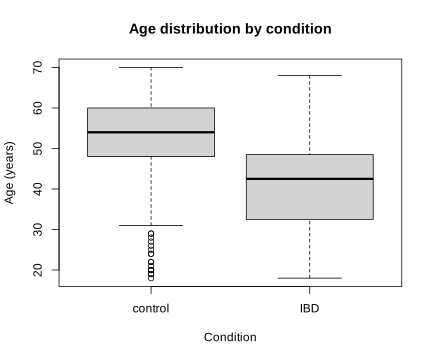{fig-alt="Boxplot of age by condition. Controls are older on average than IBD cases in this cohort."}

``` r
set.seed(1)

train_id <- sort(unlist(lapply(split(seq_len(nrow(x)), y_condition), function(idx) {
  sample(idx, size = round(0.60 * length(idx)))
})))

remaining_id <- setdiff(seq_len(nrow(x)), train_id)
valid_id <- sort(unlist(lapply(split(remaining_id, y_condition[remaining_id]), function(idx) {
  sample(idx, size = round(0.50 * length(idx)))
})))
test_id <- setdiff(remaining_id, valid_id)

split_counts <- rbind(
  train = table(factor(y_condition[train_id], levels = 0:1)),
  validation = table(factor(y_condition[valid_id], levels = 0:1)),
  test = table(factor(y_condition[test_id], levels = 0:1))
)
colnames(split_counts) <- c("control_0", "IBD_1")
split_counts

stopifnot(
  length(intersect(train_id, valid_id)) == 0,
  length(intersect(train_id, test_id)) == 0,
  length(intersect(valid_id, test_id)) == 0,
  setequal(c(train_id, valid_id, test_id), seq_len(nrow(x))),
  identical(condition == "IBD", y_condition == 1),
  nrow(x) == length(sample_id)
)

dtrain <- xgb.DMatrix(x[train_id, ], label = y_condition[train_id])
dvalid <- xgb.DMatrix(x[valid_id, ], label = y_condition[valid_id])
dtest <- xgb.DMatrix(x[test_id, ], label = y_condition[test_id])

c(train = length(train_id), validation = length(valid_id), test = length(test_id))
```

``` text
           control_0 IBD_1
train            149    89
validation        50    30
test              49    29

     train validation       test
       238         80         78
```

## Python

``` python
print(microbiome.shape)
print(len(feature_cols))
print({
    "species": sum(c.startswith("species.") for c in feature_cols),
    "genus": sum(c.startswith("genus.") for c in feature_cols),
})
print(x.shape)

print(np.isfinite(x).all())
print((x >= 0).all())
print(x.sum(axis=1).min(), x.sum(axis=1).max())
print(np.array_equal(sample_id, np.arange(1, x.shape[0] + 1)))

print(pd.Series(condition).value_counts())
print(np.isnan(age).sum())

age_summary = microbiome.groupby("condition")["age"].agg(["count", "mean", "std"])
print(age_summary)

control_age = age[(condition == "control") & ~np.isnan(age)]
ibd_age = age[(condition == "IBD") & ~np.isnan(age)]
age_test = stats.ttest_ind(control_age, ibd_age, equal_var=False)
print(age_test.pvalue)

plt.figure(figsize=(6, 5))
plt.boxplot([control_age, ibd_age], tick_labels=["control", "IBD"])
plt.xlabel("Condition")
plt.ylabel("Age (years)")
plt.title("Age distribution by condition")
plt.show()
```

``` text
(396, 608)
606
{'species': 604, 'genus': 2}
(396, 606)
True
True
97.04651999999999 100.00006000000005

control    248
IBD        148
12

           count       mean        std
condition
IBD          148  41.222973  11.153732
control      236  52.088983  11.908004
1.2957526255908205e-17
```

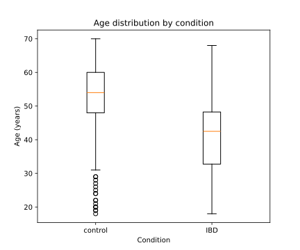{fig-alt="Boxplot of age by condition. Controls are older on average than IBD cases in this cohort."}

``` python
rng = np.random.RandomState(1)
train_parts = []
valid_parts = []
test_parts = []

for label in [0, 1]:
    class_id = np.where(y_condition == label)[0]
    class_train = rng.choice(
        class_id, size=round(0.60 * len(class_id)), replace=False
    )
    class_remaining = np.setdiff1d(class_id, class_train)
    class_valid = rng.choice(
        class_remaining, size=round(0.50 * len(class_remaining)), replace=False
    )
    class_test = np.setdiff1d(class_remaining, class_valid)

    train_parts.append(class_train)
    valid_parts.append(class_valid)
    test_parts.append(class_test)

train_id = np.sort(np.concatenate(train_parts))
valid_id = np.sort(np.concatenate(valid_parts))
test_id = np.sort(np.concatenate(test_parts))

split_counts = pd.DataFrame(
    {
        "control_0": [np.sum(y_condition[i] == 0) for i in [train_id, valid_id, test_id]],
        "IBD_1": [np.sum(y_condition[i] == 1) for i in [train_id, valid_id, test_id]],
    },
    index=["train", "validation", "test"],
)
print(split_counts)

assert len(np.intersect1d(train_id, valid_id)) == 0
assert len(np.intersect1d(train_id, test_id)) == 0
assert len(np.intersect1d(valid_id, test_id)) == 0
assert np.array_equal(
    np.sort(np.concatenate([train_id, valid_id, test_id])), np.arange(x.shape[0])
)
assert np.array_equal(condition == "IBD", y_condition == 1)
assert x.shape[0] == len(sample_id)

dtrain = xgb.DMatrix(
    x[train_id], label=y_condition[train_id], feature_names=feature_cols
)
dvalid = xgb.DMatrix(
    x[valid_id], label=y_condition[valid_id], feature_names=feature_cols
)
dtest = xgb.DMatrix(
    x[test_id], label=y_condition[test_id], feature_names=feature_cols
)

print(len(train_id), len(valid_id), len(test_id))
```

``` text
            control_0  IBD_1
train             149     89
validation         50     30
test               49     29
238 80 78
```
:::

The controls with recorded age are about 10.9 years older on average than the IBD cases, and the Welch test detects a clear group difference. This is an association within this selected case-control cohort, not evidence that IBD causes the age difference. It also means that an age-prediction model could partly learn disease-group differences rather than a general microbiome signature of aging. For the remaining exercises, `age` stays outside the predictor matrix and `condition` is the outcome.
:::::

## Exercise 2. Fit and diagnose a baseline boosted model

A baseline model gives you a reference point before you start changing settings. Watching training and validation AUC across boosting rounds also shows when the model begins to memorize the training data. Early stopping keeps the round with the best validation AUC instead of automatically using every allowed round.

Continue with `dtrain` and `dvalid` from Exercise 1. Do not use `dtest`.

**Task**

1. Fit a binary XGBoost model with `eta = 0.05`, `max_depth = 3`, `min_child_weight = 1`, `subsample = 0.8`, `colsample_bytree = 0.8`, seed `1`, and one compute thread. Allow at most 500 rounds and stop after 20 rounds without improvement in validation AUC.
2. Store the model as `model_base`, its evaluation history as `log_base`, and its best round as `best_nrounds_base`.
3. Plot training and validation AUC against boosting round. Report the best validation AUC and the training AUC at the same round.
4. Decide whether the curves show overfitting. Keep all three named objects for Exercise 3.

::: callout-tip
## Tip

Boosting adds trees sequentially. If training AUC continues toward 1 while validation AUC levels off or declines, later trees are fitting patterns that do not generalize. The validation set must be the last item in the watchlist because early stopping monitors the last dataset.
:::

::::: {.callout-note collapse="true"}
## Solution

::: panel-tabset
## R

``` r
param_base <- list(
  objective = "binary:logistic",
  eval_metric = "auc",
  eta = 0.05,
  max_depth = 3,
  min_child_weight = 1,
  subsample = 0.8,
  colsample_bytree = 0.8,
  seed = 1,
  nthread = 1
)

model_base <- xgb.train(
  params = param_base,
  data = dtrain,
  nrounds = 500,
  evals = list(train = dtrain, validation = dvalid),
  early_stopping_rounds = 20,
  verbose = 0
)

log_base <- attr(model_base, "evaluation_log")
best_nrounds_base <- attr(model_base, "early_stop")$best_iteration
best_row_base <- log_base[best_nrounds_base, ]
best_row_base

matplot(
  log_base$iter,
  cbind(log_base$train_auc, log_base$validation_auc),
  type = "l", lty = 1, lwd = 2,
  xlab = "Boosting round", ylab = "AUC",
  main = "Baseline model: training and validation AUC"
)
legend("bottomright", c("Training", "Validation"),
       col = 1:2, lty = 1, lwd = 2, bty = "n")
```

``` text
    iter train_auc validation_auc
1:    39 0.9987935      0.9373333
```

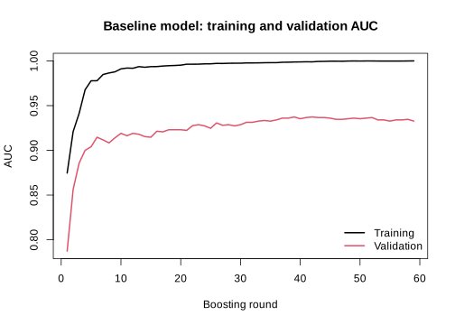{fig-alt="Training and validation AUC by boosting round for the R baseline. Training AUC approaches one while validation AUC peaks earlier and then fluctuates."}

## Python

``` python
param_base = {
    "objective": "binary:logistic",
    "eval_metric": "auc",
    "eta": 0.05,
    "max_depth": 3,
    "min_child_weight": 1,
    "subsample": 0.8,
    "colsample_bytree": 0.8,
    "seed": 1,
    "nthread": 1,
}

evals_result_base = {}
model_base = xgb.train(
    param_base,
    dtrain,
    num_boost_round=500,
    evals=[(dtrain, "train"), (dvalid, "validation")],
    early_stopping_rounds=20,
    verbose_eval=False,
    evals_result=evals_result_base,
)

log_base = pd.DataFrame({
    "round": np.arange(1, len(evals_result_base["train"]["auc"]) + 1),
    "train_auc": evals_result_base["train"]["auc"],
    "validation_auc": evals_result_base["validation"]["auc"],
})
best_nrounds_base = model_base.best_iteration + 1
best_row_base = log_base.iloc[best_nrounds_base - 1]
print(best_row_base)

plt.figure(figsize=(7, 5))
plt.plot(log_base["round"], log_base["train_auc"], label="Training")
plt.plot(log_base["round"], log_base["validation_auc"], label="Validation")
plt.xlabel("Boosting round")
plt.ylabel("AUC")
plt.title("Baseline model: training and validation AUC")
plt.legend()
plt.show()
```

``` text
round             26.000000
train_auc          0.996230
validation_auc     0.960667
```

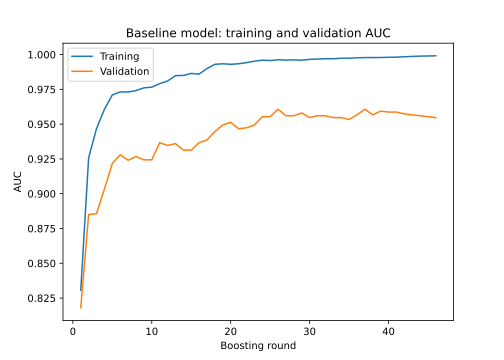{fig-alt="Training and validation AUC by boosting round for the Python baseline. Training AUC approaches one while validation AUC peaks earlier and then fluctuates."}
:::

In both tracks, training AUC becomes nearly perfect while validation AUC stops improving. That divergence is evidence of overfitting, and it is why the maximum of 500 rounds should not be used as the final round count.
:::::

## Exercise 3. Select tree depth with cross-validation

Tree depth controls how detailed each tree can become. A shallow tree may miss useful patterns. A deep tree can follow noise, especially here because there are more predictors than training samples. Cross-validation repeats the comparison across several training folds, so the choice does not depend on one lucky split.

Continue with `dtrain` from Exercise 1 and `param_base` from Exercise 2. The validation and test sets remain outside cross-validation.

**Task**

1. Compare `max_depth` values 2, 4, and 6 using stratified 5-fold cross-validation on the training set only.
2. Keep every other baseline parameter fixed, allow up to 500 rounds, and stop after 20 rounds without improvement in mean fold AUC.
3. For each depth, report its best round, mean cross-validated AUC, and fold-to-fold AUC standard deviation. Plot mean AUC with an error bar of ±1 standard deviation against depth.
4. Select the depth with the largest mean cross-validated AUC. Save it as `selected_depth` and its round count as `selected_nrounds`.
5. Refit an unweighted training-only model named `model_unweighted` with those choices and save its validation probabilities as `pred_valid_unweighted`. Keep these objects for Exercise 4.

::: callout-tip
## Tip

`max_depth` controls the complexity of each tree. Deeper trees can fit more interactions, but in a dataset with 238 training samples and 606 predictors they can also fit unstable details. Cross-validation estimates performance without consuming the external validation set.
:::

::::: {.callout-note collapse="true"}
## Solution

::: panel-tabset
## R

``` r
depth_values <- c(2, 4, 6)
cv_summary <- data.frame()

for (depth_value in depth_values) {
  param_cv <- param_base
  param_cv$max_depth <- depth_value

  set.seed(1)
  cv_fit <- xgb.cv(
    params = param_cv,
    data = dtrain,
    nrounds = 500,
    nfold = 5,
    stratified = TRUE,
    early_stopping_rounds = 20,
    verbose = 0
  )

  best_round <- cv_fit$early_stop$best_iteration
  best_row <- cv_fit$evaluation_log[best_round, ]

  cv_summary <- rbind(cv_summary, data.frame(
    max_depth = depth_value,
    best_nrounds = best_round,
    cv_auc = best_row$test_auc_mean,
    cv_auc_sd = best_row$test_auc_std
  ))
}

cv_summary

plot(cv_summary$max_depth, cv_summary$cv_auc,
     type = "b", pch = 19, ylim = c(0.79, 0.96),
     xlab = "max_depth", ylab = "Cross-validated AUC",
     main = "Tree-depth comparison")
arrows(cv_summary$max_depth,
       cv_summary$cv_auc - cv_summary$cv_auc_sd,
       cv_summary$max_depth,
       cv_summary$cv_auc + cv_summary$cv_auc_sd,
       angle = 90, code = 3, length = 0.05)

selected_row <- cv_summary[which.max(cv_summary$cv_auc), ]
selected_depth <- selected_row$max_depth
selected_nrounds <- selected_row$best_nrounds

param_unweighted <- param_base
param_unweighted$max_depth <- selected_depth

model_unweighted <- xgb.train(
  params = param_unweighted,
  data = dtrain,
  nrounds = selected_nrounds,
  verbose = 0
)
pred_valid_unweighted <- predict(model_unweighted, dvalid)
```

``` text
  max_depth best_nrounds    cv_auc cv_auc_sd
1         2           65 0.8769974 0.0690876
2         4           64 0.8825463 0.0719449
3         6           56 0.8769951 0.0622564
```

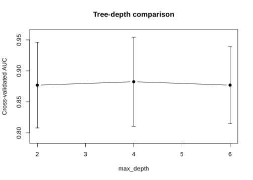{fig-alt="Cross-validated AUC with one-standard-deviation error bars for max_depth 2, 4, and 6 in R. Depth 4 has the largest mean, but the uncertainty intervals overlap."}

## Python

``` python
depth_rows = []

for depth_value in [2, 4, 6]:
    param_cv = {**param_base, "max_depth": depth_value}
    cv_fit = xgb.cv(
        param_cv,
        dtrain,
        num_boost_round=500,
        nfold=5,
        stratified=True,
        seed=1,
        early_stopping_rounds=20,
        verbose_eval=False,
    )

    best_row = cv_fit.iloc[-1]
    depth_rows.append({
        "max_depth": depth_value,
        "best_nrounds": len(cv_fit),
        "cv_auc": best_row["test-auc-mean"],
        "cv_auc_sd": best_row["test-auc-std"],
    })

cv_summary = pd.DataFrame(depth_rows)
print(cv_summary)

plt.figure(figsize=(7, 5))
plt.errorbar(
    cv_summary["max_depth"], cv_summary["cv_auc"],
    yerr=cv_summary["cv_auc_sd"], marker="o", capsize=4,
)
plt.xlabel("max_depth")
plt.ylabel("Cross-validated AUC")
plt.title("Tree-depth comparison")
plt.ylim(0.79, 0.96)
plt.show()

selected_row = cv_summary.loc[cv_summary["cv_auc"].idxmax()]
selected_depth = int(selected_row["max_depth"])
selected_nrounds = int(selected_row["best_nrounds"])

param_unweighted = {**param_base, "max_depth": selected_depth}
model_unweighted = xgb.train(
    param_unweighted, dtrain, num_boost_round=selected_nrounds,
    verbose_eval=False,
)
pred_valid_unweighted = model_unweighted.predict(dvalid)
```

``` text
   max_depth  best_nrounds    cv_auc  cv_auc_sd
0          2           212  0.890487    0.036786
1          4           151  0.892272    0.030750
2          6           140  0.893998    0.027174
```

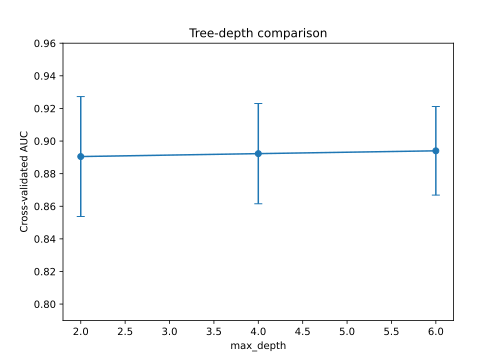{fig-alt="Cross-validated AUC with one-standard-deviation error bars for max_depth 2, 4, and 6 in Python. Depth 6 has the largest mean, but the uncertainty intervals overlap."}
:::

R selects depth 4. Python selects depth 6. The differences in mean AUC are small compared with the variation across folds. Performance is similar across these candidates, and the selected depth depends on the rows assigned to each fold.
:::::

## Exercise 4. Evaluate class weighting and choose a threshold

There are 248 controls and 148 IBD cases in the full dataset. A classifier can therefore achieve fairly high ordinary accuracy by favoring controls, even if it misses many IBD cases. Sensitivity and balanced accuracy make those missed cases more visible.

XGBoost can give more influence to the positive class during training through `scale_pos_weight`. In this chapter, IBD is coded as `1`, so IBD is the positive class and control is the negative class. The usual starting value in the [XGBoost documentation](https://xgboost.readthedocs.io/en/latest/parameter.html) is the number of negative training cases divided by the number of positive training cases. For this split, that is (149 / 89 = 1.674).

This ratio is a sensible value to try, not a rule that must improve the model. The imbalance here is moderate, and the unweighted model may still perform as well as or better than the weighted model. Weighting can also shift the probability scale. Treat the outputs as prediction scores unless calibration has been checked separately. In this exercise, AUC is used to compare the two models because it does not depend on one cutoff. The threshold is chosen afterward from the validation data.

Continue with `dtrain`, `dvalid`, `train_id`, and `y_condition` from Exercise 1, plus `param_unweighted`, `selected_nrounds`, `model_unweighted`, and `pred_valid_unweighted` from Exercise 3. Do not use the test set.

The weighting value is

$$
\texttt{scale\_pos\_weight} = \frac{n_{\text{control, train}}}{n_{\text{IBD, train}}}.
$$

This gives each positive training case more influence on the fitted trees. It does not create new samples or change the validation and test sets.

**Task**

1. Compute `scale_pos_weight_value` from the training set only.
2. With the selected depth from Exercise 3, use stratified 5-fold cross-validation on the training set to choose the weighted model's round count. Fit `model_weighted` on the full training set and save `pred_valid_weighted`.
3. Compare unweighted and weighted validation AUC and their sensitivity, specificity, balanced accuracy, and accuracy at threshold 0.5.
4. Choose the candidate with the larger validation AUC. Save its parameters as `final_params`, its round count as `final_nrounds`, and its validation probabilities as `pred_valid_selected`.
5. For the selected candidate, evaluate thresholds from 0.20 through 0.80 in increments of 0.02. Choose the threshold with the largest validation balanced accuracy. If several thresholds tie, choose the one closest to 0.5. Save it as `final_threshold`.
6. Plot validation sensitivity and specificity against threshold. Keep `final_params`, `final_nrounds`, and `final_threshold` for Exercise 5.

::: callout-tip
## Tip

Calculate class weights only from training observations. Weighting changes how the model is fitted. The threshold changes how its scores become class labels. Neither is guaranteed to improve every metric.
:::

::::: {.callout-note collapse="true"}
## Solution

::: panel-tabset
## R

``` r
n_control_train <- sum(y_condition[train_id] == 0)
n_ibd_train <- sum(y_condition[train_id] == 1)
scale_pos_weight_value <- n_control_train / n_ibd_train
scale_pos_weight_value

param_weighted <- param_unweighted
param_weighted$scale_pos_weight <- scale_pos_weight_value

set.seed(1)
cv_weighted <- xgb.cv(
  params = param_weighted,
  data = dtrain,
  nrounds = 500,
  nfold = 5,
  stratified = TRUE,
  early_stopping_rounds = 20,
  verbose = 0
)
weighted_nrounds <- cv_weighted$early_stop$best_iteration

model_weighted <- xgb.train(
  params = param_weighted,
  data = dtrain,
  nrounds = weighted_nrounds,
  verbose = 0
)
pred_valid_weighted <- predict(model_weighted, dvalid)

auc_valid_unweighted <- as.numeric(auc(
  y_condition[valid_id], pred_valid_unweighted, quiet = TRUE
))
auc_valid_weighted <- as.numeric(auc(
  y_condition[valid_id], pred_valid_weighted, quiet = TRUE
))

validation_comparison <- rbind(
  unweighted = c(
    AUC = auc_valid_unweighted,
    binary_metrics(pred_valid_unweighted, y_condition[valid_id], 0.5)
  ),
  weighted = c(
    AUC = auc_valid_weighted,
    binary_metrics(pred_valid_weighted, y_condition[valid_id], 0.5)
  )
)
round(validation_comparison, 3)

if (auc_valid_weighted > auc_valid_unweighted) {
  selected_variant <- "weighted"
  final_params <- param_weighted
  final_nrounds <- weighted_nrounds
  pred_valid_selected <- pred_valid_weighted
} else {
  selected_variant <- "unweighted"
  final_params <- param_unweighted
  final_nrounds <- selected_nrounds
  pred_valid_selected <- pred_valid_unweighted
}

threshold_grid <- seq(0.20, 0.80, by = 0.02)
threshold_results <- do.call(rbind, lapply(threshold_grid, function(threshold) {
  c(threshold = threshold,
    binary_metrics(pred_valid_selected, y_condition[valid_id], threshold))
}))

best_balanced_accuracy <- max(threshold_results[, "balanced_accuracy"])
best_candidates <- which(
  threshold_results[, "balanced_accuracy"] == best_balanced_accuracy
)
best_index <- best_candidates[
  which.min(abs(threshold_results[best_candidates, "threshold"] - 0.5))
]
final_threshold <- threshold_results[best_index, "threshold"]

selected_variant
final_nrounds
threshold_results[best_index, ]

matplot(
  threshold_results[, "threshold"],
  threshold_results[, c("sensitivity", "specificity")],
  type = "l", lty = 1, lwd = 2,
  xlab = "Probability threshold", ylab = "Validation metric",
  main = "Threshold selection on validation data"
)
abline(v = final_threshold, lty = 2)
legend("bottom", c("Sensitivity", "Specificity", "Selected threshold"),
       col = c(1, 2, 1), lty = c(1, 1, 2), lwd = c(2, 2, 1), bty = "n")
```

``` text
[1] 1.674157

             AUC sensitivity specificity balanced_accuracy accuracy
unweighted 0.942       0.767       0.980             0.873    0.900
weighted   0.941       0.833       0.920             0.877    0.888

[1] "unweighted"
[1] 64
        threshold       sensitivity       specificity balanced_accuracy
            0.340             0.900             0.920             0.910
         accuracy
            0.912
```

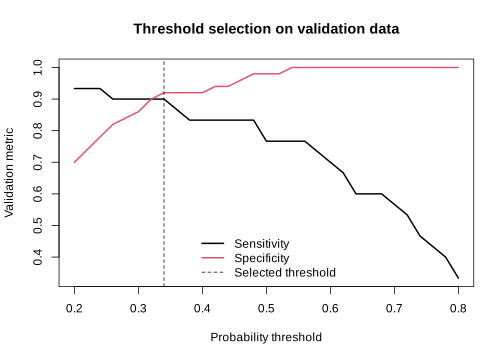{fig-alt="Validation sensitivity and specificity over probability thresholds in R, with the selected threshold of 0.34 marked by a vertical line."}

## Python

``` python
n_control_train = np.sum(y_condition[train_id] == 0)
n_ibd_train = np.sum(y_condition[train_id] == 1)
scale_pos_weight_value = n_control_train / n_ibd_train
print(scale_pos_weight_value)

param_weighted = {
    **param_unweighted,
    "scale_pos_weight": scale_pos_weight_value,
}

cv_weighted = xgb.cv(
    param_weighted,
    dtrain,
    num_boost_round=500,
    nfold=5,
    stratified=True,
    seed=1,
    early_stopping_rounds=20,
    verbose_eval=False,
)
weighted_nrounds = len(cv_weighted)

model_weighted = xgb.train(
    param_weighted, dtrain, num_boost_round=weighted_nrounds,
    verbose_eval=False,
)
pred_valid_weighted = model_weighted.predict(dvalid)

auc_valid_unweighted = roc_auc_score(
    y_condition[valid_id], pred_valid_unweighted
)
auc_valid_weighted = roc_auc_score(
    y_condition[valid_id], pred_valid_weighted
)

validation_comparison = pd.DataFrame([
    {
        "model": "unweighted",
        "AUC": auc_valid_unweighted,
        **binary_metrics(pred_valid_unweighted, y_condition[valid_id], 0.5),
    },
    {
        "model": "weighted",
        "AUC": auc_valid_weighted,
        **binary_metrics(pred_valid_weighted, y_condition[valid_id], 0.5),
    },
]).set_index("model")
print(validation_comparison.round(3))

if auc_valid_weighted > auc_valid_unweighted:
    selected_variant = "weighted"
    final_params = param_weighted.copy()
    final_nrounds = weighted_nrounds
    pred_valid_selected = pred_valid_weighted
else:
    selected_variant = "unweighted"
    final_params = param_unweighted.copy()
    final_nrounds = selected_nrounds
    pred_valid_selected = pred_valid_unweighted

threshold_grid = np.round(np.arange(0.20, 0.8001, 0.02), 2)
threshold_results = pd.DataFrame([
    {
        "threshold": threshold,
        **binary_metrics(
            pred_valid_selected, y_condition[valid_id], threshold
        ),
    }
    for threshold in threshold_grid
])
threshold_results["distance_from_05"] = abs(threshold_results["threshold"] - 0.5)
best_row = threshold_results.sort_values(
    ["balanced_accuracy", "distance_from_05"],
    ascending=[False, True],
).iloc[0]
final_threshold = float(best_row["threshold"])

print(selected_variant)
print(final_nrounds)
print(best_row.drop(labels="distance_from_05").round(3))

plt.figure(figsize=(7, 5))
plt.plot(threshold_results["threshold"], threshold_results["sensitivity"],
         label="Sensitivity")
plt.plot(threshold_results["threshold"], threshold_results["specificity"],
         label="Specificity")
plt.axvline(final_threshold, color="black", linestyle="--",
            label="Selected threshold")
plt.xlabel("Probability threshold")
plt.ylabel("Validation metric")
plt.title("Threshold selection on validation data")
plt.legend()
plt.show()
```

``` text
1.6741573033707866

              AUC  sensitivity  specificity  balanced_accuracy  accuracy
model
unweighted  0.968        0.733         0.96              0.847     0.875
weighted    0.977        0.833         0.96              0.897     0.912

weighted
184
threshold            0.400
sensitivity          0.933
specificity          0.940
balanced_accuracy    0.937
accuracy             0.938
```

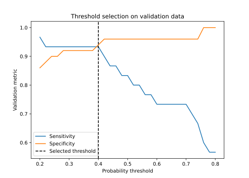{fig-alt="Validation sensitivity and specificity over probability thresholds in Python, with the selected threshold of 0.40 marked by a vertical line."}
:::

At threshold 0.5, weighting improves sensitivity in both tracks. Its effect on AUC differs. R keeps the unweighted model, while Python selects the weighted model. This is why the weighted result is checked rather than assumed to be better. Both selected thresholds are below 0.5 because balanced accuracy gives equal importance to IBD sensitivity and control specificity.

The same validation set was used to compare the two models and choose the threshold. These validation metrics describe model development, not final performance. Exercise 5 gives the untouched test result. With a larger dataset, a separate calibration set could be used for threshold selection.
:::::

## Exercise 5. Refit once, evaluate the test set, and interpret cautiously

The model settings and threshold are now fixed. Combining the training and validation rows gives the final model more data, while the untouched test set provides a fair last check. Feature importance can show which microbial abundances helped prediction, but it cannot show that those microbes cause IBD.

Continue with `train_id`, `valid_id`, `test_id`, `dtest`, `final_params`, `final_nrounds`, and `final_threshold` from the earlier exercises. This is the first exercise in which test predictions are allowed.

**Task**

1. Combine the training and validation rows into `dev_id` and `ddev`. Refit `final_model` on all development observations with the already selected parameters and round count. Do not run new tuning.
2. Predict the untouched test set once. Report test AUC, the 2 × 2 confusion matrix at `final_threshold`, sensitivity, specificity, balanced accuracy, and accuracy. Determine the majority class from `dev_id`, then compare accuracy with a classifier that always predicts that class on the test set.
3. Plot the ROC curve. Report the ten predictors with greatest gain in `final_model` and make a horizontal importance plot.
4. As a fixed sensitivity check, fit an XGBoost random-forest-style classifier on `ddev` with one boosting round, 300 parallel trees, `eta = 1`, `max_depth = 4`, `subsample = 0.8`, `colsample_bytree = 0.8`, seed `1`, and one thread. Compare its test AUC with the boosted model's test AUC. Do not change the chosen final model after seeing this comparison.
5. State what the analysis supports and what it does not support about IBD and the microbial features.

::: callout-tip
## Tip

With `num_parallel_tree = 300` and one boosting round, XGBoost averages many randomized trees instead of adding sequential corrections. This is a random-forest-style sensitivity model, not a claim that it reproduces every default of a separate random-forest package.
:::

::::: {.callout-note collapse="true"}
## Solution

::: panel-tabset
## R

``` r
dev_id <- c(train_id, valid_id)
ddev <- xgb.DMatrix(x[dev_id, ], label = y_condition[dev_id])

final_model <- xgb.train(
  params = final_params,
  data = ddev,
  nrounds = final_nrounds,
  verbose = 0
)

pred_test <- predict(final_model, dtest)
test_auc <- as.numeric(auc(y_condition[test_id], pred_test, quiet = TRUE))
test_metrics <- binary_metrics(
  pred_test, y_condition[test_id], final_threshold
)
pred_class_test <- ifelse(pred_test >= final_threshold, 1, 0)
test_confusion <- table(
  Predicted = factor(pred_class_test, levels = 0:1),
  Observed = factor(y_condition[test_id], levels = 0:1)
)
majority_class <- as.numeric(mean(y_condition[dev_id]) >= 0.5)
majority_accuracy <- mean(y_condition[test_id] == majority_class)

test_auc
round(test_metrics, 3)
test_confusion
majority_accuracy

roc_test <- roc(y_condition[test_id], pred_test, quiet = TRUE)
plot(roc_test, main = "Final boosted model: test ROC")
abline(a = 0, b = 1, lty = 2, col = "gray50")

importance <- xgb.importance(model = final_model)
top_importance <- head(importance, 10)
top_importance

barplot(
  rev(top_importance$Gain),
  names.arg = rev(top_importance$Feature),
  horiz = TRUE, las = 1, cex.names = 0.65,
  xlab = "Proportion of total gain",
  main = "Top 10 predictors in the final boosted model"
)
```

``` text
[1] 0.8789585

      sensitivity       specificity balanced_accuracy          accuracy
            0.655             0.837             0.746             0.769

         Observed
Predicted  0  1
        0 41 10
        1  8 19

[1] 0.6282051
```

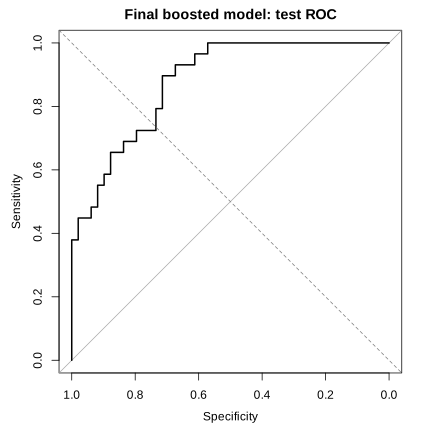{fig-alt="ROC curve on the untouched R test set for the final boosted model, with an AUC of about 0.879."}

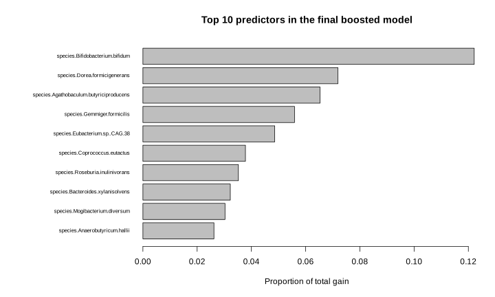{fig-alt="Horizontal bar chart of the ten microbial predictors with greatest gain in the final R boosted model."}

``` r
param_rf_style <- list(
  objective = "binary:logistic",
  eval_metric = "auc",
  eta = 1,
  max_depth = 4,
  min_child_weight = 1,
  subsample = 0.8,
  colsample_bytree = 0.8,
  num_parallel_tree = 300,
  seed = 1,
  nthread = 1
)

model_rf_style <- xgb.train(
  params = param_rf_style,
  data = ddev,
  nrounds = 1,
  verbose = 0
)
pred_test_rf <- predict(model_rf_style, dtest)
test_auc_rf <- as.numeric(auc(
  y_condition[test_id], pred_test_rf, quiet = TRUE
))

c(boosted_AUC = test_auc, random_forest_style_AUC = test_auc_rf)
```

``` text
             boosted_AUC random_forest_style_AUC
               0.8789585               0.8085855
```

## Python

``` python
dev_id = np.concatenate([train_id, valid_id])
ddev = xgb.DMatrix(
    x[dev_id], label=y_condition[dev_id], feature_names=feature_cols
)

final_model = xgb.train(
    final_params, ddev, num_boost_round=final_nrounds,
    verbose_eval=False,
)

pred_test = final_model.predict(dtest)
test_auc = roc_auc_score(y_condition[test_id], pred_test)
test_metrics = binary_metrics(
    pred_test, y_condition[test_id], final_threshold
)
pred_class_test = (pred_test >= final_threshold).astype(int)
test_confusion = confusion_matrix(
    y_condition[test_id], pred_class_test, labels=[0, 1]
)
majority_class = int(np.mean(y_condition[dev_id]) >= 0.5)
majority_accuracy = np.mean(y_condition[test_id] == majority_class)

print(test_auc)
print({k: round(v, 3) for k, v in test_metrics.items()})
print(test_confusion)
print(majority_accuracy)

fpr, tpr, _ = roc_curve(y_condition[test_id], pred_test)
plt.figure(figsize=(6, 6))
plt.plot(fpr, tpr, label=f"AUC = {test_auc:.3f}")
plt.plot([0, 1], [0, 1], linestyle="--", color="gray")
plt.xlabel("False-positive rate")
plt.ylabel("True-positive rate")
plt.title("Final boosted model: test ROC")
plt.legend()
plt.show()

gain = final_model.get_score(importance_type="gain")
importance = pd.DataFrame({
    "Feature": list(gain.keys()),
    "Gain": list(gain.values()),
})
importance["Gain"] = importance["Gain"] / importance["Gain"].sum()
top_importance = importance.nlargest(10, "Gain")
print(top_importance)

top_importance.sort_values("Gain").plot.barh(
    x="Feature", y="Gain", legend=False, figsize=(8, 5)
)
plt.xlabel("Proportion of total gain")
plt.title("Top 10 predictors in the final boosted model")
plt.tight_layout()
plt.show()
```

``` text
0.9352568613652358
{'sensitivity': 0.793, 'specificity': 0.918,
 'balanced_accuracy': 0.856, 'accuracy': 0.872}
[[45  4]
 [ 6 23]]
0.6282051282051282
```

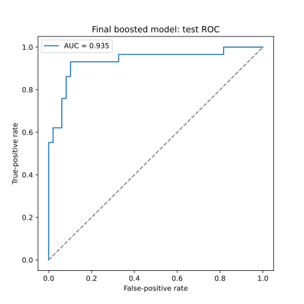{fig-alt="ROC curve on the untouched Python test set for the final boosted model, with an AUC of about 0.935."}

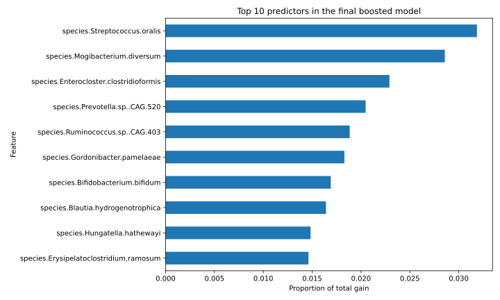{fig-alt="Horizontal bar chart of the ten microbial predictors with greatest gain in the final Python boosted model."}

``` python
param_rf_style = {
    "objective": "binary:logistic",
    "eval_metric": "auc",
    "eta": 1,
    "max_depth": 4,
    "min_child_weight": 1,
    "subsample": 0.8,
    "colsample_bytree": 0.8,
    "num_parallel_tree": 300,
    "seed": 1,
    "nthread": 1,
}

model_rf_style = xgb.train(
    param_rf_style, ddev, num_boost_round=1,
    verbose_eval=False,
)
pred_test_rf = model_rf_style.predict(dtest)
test_auc_rf = roc_auc_score(y_condition[test_id], pred_test_rf)

print({
    "boosted_AUC": test_auc,
    "random_forest_style_AUC": test_auc_rf,
})
```

``` text
{'boosted_AUC': 0.9352568613652358,
 'random_forest_style_AUC': 0.9232934553131598}
```
:::

On this test split, the boosted model separates IBD cases from controls better than the majority-class accuracy baseline. The random-forest-style model also performs reasonably well, but its test AUC is lower in both language tracks with these settings.

The importance table shows which microbial abundances the model used most. It does not show the direction of a relationship. It also does not establish that an organism causes or protects against IBD. These are observational data from one case-control study. Another cohort would be needed to check whether the prediction results and feature rankings hold elsewhere. Treatment, geography, diet, medication, age, and other group differences may also affect the results.
:::::
