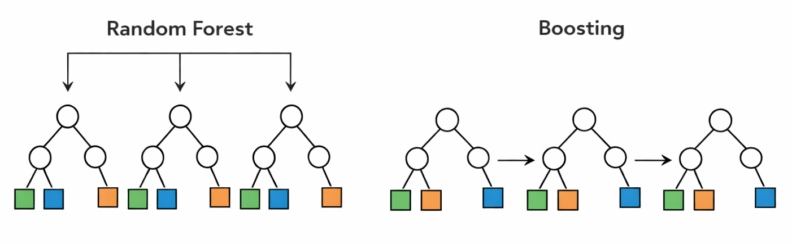

# Introduction

As you probably remember, supervised learning refers to methods that use prior information from labeled data to learn the relationship between a set of input features and an outcome. In other words, we provide the algorithm with examples where both the predictors and the correct answers are already known, and the goal is to learn a pattern that can later be used to make predictions for new observations.

In the context of XGBoost, the outcome can be continuous, such as a numerical measurement in a regression problem, or categorical, such as class labels in a classification problem. The main idea is always the same: we want to build a model that can accurately predict the outcome from the available features.

What makes XGBoost especially interesting is that it belongs to a family of supervised learning methods called boosting. Instead of building one single large model all at once, boosting gradually builds the final model step by step. At each step, it tries to correct the mistakes made by the current model, leading to a strong predictive model formed by many small models working together.

# Boosting vs random forest

To remind you, random forest is an ensemble learning method that builds many decision trees and combines their predictions. Each tree is usually grown independently from the others, often using a bootstrap sample of the data and a random subset of features at each split. The main idea is that, although each individual tree may be noisy or unstable, averaging many trees together can produce a model that is much more robust and accurate.

Boosting also combines many trees, but the philosophy is different. Instead of building all trees independently, boosting builds them sequentially. Each new tree is trained to focus on the mistakes made by the current model. In this way, the model is gradually improved step by step, with each tree acting as a correction rather than as an independent voter.

This is one of the main conceptual differences between random forest and boosting. Random forest reduces variance by averaging many strong but noisy trees, whereas boosting aims to reduce bias by adding many small trees that gradually improve the fit. As a result, random forest is often easier to tune and more robust out of the box, while boosting can sometimes achieve higher predictive performance when carefully trained.

In XGBoost, this boosting idea is pushed even further by using a principled optimization framework, regularization, and efficient computation. Before going into the mathematics, however, it is important to first build a clear intuition for how this sequential correction process works.



# How boosting works

We are going to simulate a simple dataset and use it to build intuition for how boosting works. The goal here is not to understand every mathematical detail yet, but to first see the general idea in action on data with a clear underlying pattern. 

```{r}
#| code-fold: true
set.seed(10)
n <- 500
time <- sort(runif(n, min = 0, max = 24))

# true rhythmic signal + noise
y <- 2 +
  1.2 * sin(2 * pi * time / 24) +
  0.6 * cos(2 * pi * time / 24) +
  rnorm(n, sd = 0.25)

dat <- data.frame(
  time = time,
  y = y
)

plot(dat$time,dat$y,main="Simulated rhythmic signal",xlab="time",ylab="response")

```


In this example, we simulated a rhythmic signal across time and add some random noise. 


::: {.callout-important}
In the rest of this chapter I'm going to fit very simple models for the purpose of demonstration. In reality we can achieve a very good fit with a bit more complex model.
:::

Let's use `xgboost` to first to fit the data using a decision tree and see the prediciton

```{r}
#| code-fold: true

library(xgboost)
X <- as.matrix(dat["time"])
dtrain <- xgb.DMatrix(data = X, label = dat$y)

# -----------------------------
# params for fitting a simple RF
# -----------------------------

params_rf <- list(
  booster = "gbtree",
  objective = "reg:squarederror",
  eta = 1,          
  max_depth = 2,      
  min_child_weight = 1,
  colsample_bytree = 1,
  lambda = 0,
  subsample= 0.8,
  num_parallel_tree= 1,
  "tree_method"= "hist",
  "colsample_bynode"= 0.8,
  learning_rate=1
)

fit_rf <- xgb.train(
  params = params_rf,
  data = dtrain,
  nrounds = 1,
  verbose = 0,
)

pred_train <- predict(fit_rf,newdata=X)

plot(dat$time, dat$y,
     pch = 16, cex = 0.8,
     xlab = "Time",
     ylab = "Response",
     main = "Fitted data decision tree",col="blue")

points(dat$time,pred_train,col="red")
legend("topright",
       legend = c("Training data", "Prediction"),
       col = c("blue", "red"),pch = c(16,16),
       bty = "n")
```

The blue points are the observed training data. The red points are the decision tree predictions. What is important to notice is that the prediction does not follow the curve smoothly. Instead, it stays constant over intervals of time and then suddenly jumps to a new level.

So, basically, a single decision tree is not enough to explain this curve. How about we now fit a random forest with 10, 100 and 1000 decision trees?

```{r}
#| code-fold: true

params_rf$num_parallel_tree<-10
fit_rf_10 <- xgb.train(
  params = params_rf,
  data = dtrain,
  nrounds = 1,
  verbose = 0
)

params_rf$num_parallel_tree<-100
fit_rf_100 <- xgb.train(
  params = params_rf,
  data = dtrain,
  nrounds = 1,
  verbose = 0
)
params_rf$num_parallel_tree<-1000
fit_rf_1000 <- xgb.train(
  params = params_rf,
  data = dtrain,
  nrounds = 1,
  verbose = 0
)

pred_train10 <- predict(fit_rf_10,newdata=X)
pred_train100 <- predict(fit_rf_100,newdata=X)
pred_train1000 <- predict(fit_rf_1000,newdata=X)

par(mfrow=c(2,2))
plot(dat$time, dat$y,
     pch = 16, cex = 0.8,
     xlab = "Time",
     ylab = "Response",
     main = "Fitted data decision tree",col="blue")

points(dat$time,pred_train,col="red")
plot(dat$time, dat$y,
     pch = 16, cex = 0.8,
     xlab = "Time",
     ylab = "Response",
     main = "Fitted data RF 10",col="blue")

points(dat$time,pred_train10,col="red")
plot(dat$time, dat$y,
     pch = 16, cex = 0.8,
     xlab = "Time",
     ylab = "Response",
     main = "Fitted data RF 100",col="blue")

points(dat$time,pred_train100,col="red")
plot(dat$time, dat$y,
     pch = 16, cex = 0.8,
     xlab = "Time",
     ylab = "Response",
     main = "Fitted data RF 1000",col="blue")

points(dat$time,pred_train1000,col="red")

legend("topright",
       legend = c("Training data", "Prediction"),
       col = c("blue", "red"),pch = c(16,16),
       bty = "n")
```

What you see is essentially the same prediction as a single decision tree. What i want to tell you here is that random forest adds more true mostly to reduce the variance but if the relationship is very complex and cannot be captured by a tree, no matter how many trees you fit using random forest, the resulting accuracy is going to be more or less the same. The reason is that random forest builds trees independently and then averages their predictions. Averaging helps cancel noise and prevents overreaction to peculiarities in individual trees, but it does not force later trees to specifically correct the mistakes made by earlier ones. So if there is a systematic part of the pattern that the trees are not capturing well, random forest does not directly target that error. It mainly produces a more robust average of similar kinds of fits.


::: {.callout-note}
Obivously this was just an example, in fact we could simply increase the depth of the tree and RF fits much better than what we you saw!!
:::


## Correcting the past mistkes

What we want to do now is to still create a lot of decision trees, but this time, each decision tree is going correct the errors of the previous ones. 


But first let's develop an intuition what we mean by correcting the errors

Let's start looking at our data again.

```{r}
#| code-fold: true

set.seed(10)
n <- 500
time <- sort(runif(n, min = 0, max = 24))

# true rhythmic signal + noise
y <- 2 +
  1.2 * sin(2 * pi * time / 24) +
  0.6 * cos(2 * pi * time / 24) +
  rnorm(n, sd = 0.25)

dat <- data.frame(
  time = time,
  y = y
)

plot(dat$time,dat$y,main="Simulated rhythmic signal",xlab="time",ylab="response",col="blue") 
```

We are now going to naively add some predictitons to the plot. let's say we have predicted every blue points to have `0.5` response

```{r}
#| code-fold: true

plot(dat$time,dat$y,main="Simulated rhythmic signal",xlab="time",ylab="response",col="blue") 
round1<-rep(0.5,length(dat$y)) 
points(dat$time,round1,col="red")

```


If you look at the data along the time axis, you can see that many of the predictions are incorrect. On the left side of the plot, the errors are quite large, meaning that the predicted values are far from the observed data. Around time `15`, however, the differences between the predictions and the actual observations are much smaller. Toward the right side of the plot, the predictions are still off, but the errors are generally smaller than those on the left.

Now suppose I ask you to improve this prediction. Would you correct every point by the same amount? Probably not. If a prediction is only slightly wrong, it only needs a small correction. But if it is far from the true value, it needs a much larger correction. So ideally, we would like the next step of the model to pay more attention to places where the current prediction is doing badly, and less attention to places where it is already performing reasonably well.

Now suppose I give you a single vertical split, so that you can divide the time axis into two regions and adjust the prediction separately on each side. Where would you place that split?

A sensible choice would be to place it where the behavior of the errors changes most clearly. In this plot, the prediction is much too low on the left side, while around the middle and right side the errors are smaller and behave differently. So we would like to put the split at a point that separates the region with large underestimation from the region where the current prediction is already closer to the data.

The exact best split is the one that leads to the greatest reduction in error after we assign a separate correction to the observations on the left and right sides. In other words, we are looking for the split that creates two groups whose residuals can be corrected as effectively as possible with two simple values.


```{r}
#| code-fold: true

plot(dat$time,dat$y,main="Simulated rhythmic signal",xlab="time",ylab="response",col="blue") 
round1<-rep(0.5,length(dat$y)) 
points(dat$time,round1,col="red")
abline(v = 9,lwd=2,col="green")
```

We have now decided where to place the vertical split (at `9`). The next question is: by how much should we adjust our naive prediction of `0.5` on each side?

A simple and sensible idea is to look, separately on each side of the split, at how far the observed values are from `0.5` on average. In other words, for all points on the left side, we calculate the average error relative to `0.5`, and we do the same for all points on the right side.

```{r}
#| code-fold: true

plot(dat$time,dat$y,main="Simulated rhythmic signal",xlab="time",ylab="response",col="blue") 
round1<-rep(0.5,length(dat$y)) 
points(dat$time,round1,col="red")
abline(v = 9,lwd=2,col="green")
arrows(
  x0 = dat$time, y0 = dat$y,
  x1 = dat$time, y1 = round1,
  length = 0.05, angle = 20,
  col = adjustcolor("gray40", alpha.f = 0.3),
  lty = 1
)

```

That average error becomes the correction for that side. So if the points on the left are, on average, much higher than `0.5`, then the correction on the left will be positive and fairly large. If the points on the right are only slightly above `0.5`, then the correction there will be smaller. And if the points in a region are below `0.5` on average, then the correction would be negative.

So the idea is very intuitive: on each side of the split, we ask whether our current prediction is too low or too high on average, and then we shift it accordingly. This gives us one correction for the left region and one correction for the right region.

In that sense, the first step in boosting is simply learning two things: where to split the data, and how much to correct the prediction in each resulting region.

In our case the left side has correction factor of `{r} print(mean((dat$y-round1)[dat$time<9]))` and right side has `{r} print(mean((dat$y-round1)[dat$time>=9]))`.


We can now take our old prediction and simple add the correction factor to them (separately in left and right side of the split)

```{r}
#| code-fold: true

split_val<-9
plot(dat$time,dat$y,main="Simulated rhythmic signal",xlab="time",ylab="response",col="blue") 
round1<-rep(0.5,length(dat$y)) 
round1[dat$time<split_val]<-round1[dat$time<split_val]+mean((dat$y-round1)[dat$time<split_val])
round1[dat$time>split_val]<-round1[dat$time>=split_val]+mean((dat$y-round1)[dat$time>=split_val])
points(dat$time,round1,col="red")
abline(v = 9,lwd=2,col="green")

```

We can now see the updated predictions. They already look much better than the original flat prediction at `0.5`. Instead of assigning the same value to every observation, we now allow the prediction to shift differently in two regions of the time axis. On the left side, where the original errors were larger, the prediction is adjusted by a larger amount. On the right side, where the errors were different, the prediction receives a different correction.

What we have done here is actually very important. We did not try to rebuild the whole model from scratch. Instead, we started with a very naive prediction, looked at where it was wrong, made one split, and then corrected the prediction separately in the two resulting regions. This is the basic idea behind boosting: each new step does not try to solve the entire problem at once, but instead tries to improve the current model by correcting its remaining errors.

Of course, this updated prediction is still not perfect. It is still piecewise constant, and there are still clear discrepancies between the fitted values and the observed data. But it is better than before, and that is exactly the point. Boosting works by repeating this idea many times. At each round, a new small tree is fitted to the remaining errors, and its corrections are added to the current prediction. Over time, these many small improvements can build a much stronger model.


Now let's di this a few more times and see what happens. looking at the data again the new predictions seem to be more off at the far right of the plot maybe around `21` so let's adjust that part:

```{r}
#| code-fold: true

split_val<-21
round1[dat$time<split_val]<-round1[dat$time<split_val]+mean((dat$y-round1)[dat$time<split_val])
round1[dat$time>split_val]<-round1[dat$time>=split_val]+mean((dat$y-round1)[dat$time>=split_val])
plot(dat$time,dat$y,main="Simulated rhythmic signal",xlab="time",ylab="response",col="blue") 
points(dat$time,round1,col="red")
abline(v = split_val,lwd=2,col="green")

```


You can already see that we have started to capture the shape of the curve. Even with just one split and two simple corrections, the prediction is already much better than the original flat line. This is exactly the kind of gradual improvement that boosting is built on.

Of course, we cannot do this manually every time. We therefore need an automatic way to choose the next split. One natural idea would be to try many possible split points along the time axis and, for each one, calculate how well the updated prediction matches the observed data after applying the left and right corrections. We can then select the split that gives the greatest improvement.

In practice, this means that for every candidate split, we temporarily divide the data into two parts, compute the correction on each side, update the predictions, and measure how much error remains. The best split is simply the one that leaves us with the smallest prediction error.

So instead of asking by eye where the split should go, we let the algorithm search through all possible split locations and choose the one that improves the current model the most. This is the basic idea behind how a tree decides where to split inside boosting.

```{r}
#| code-fold: true
par(mfrow=c(2,3))
round1 <- rep(0.5, length(dat$y))
round2<-round1
for(ii in 1:1000)
  {

candidate_splits <- sort(unique(dat$time))

sse_all <- rep(NA, length(candidate_splits))

for (i in seq_along(candidate_splits)) {
  
  split_val <- candidate_splits[i]
  pred_tmp <- round1
  
  if (sum(dat$time < split_val) == 0 || sum(dat$time >= split_val) == 0) next
  
  pred_tmp[dat$time < split_val]  <- pred_tmp[dat$time < split_val] +
    mean((dat$y - pred_tmp)[dat$time < split_val])
  
  pred_tmp[dat$time >= split_val] <- pred_tmp[dat$time >= split_val] +
    mean((dat$y - pred_tmp)[dat$time >= split_val])
  
    sse_all[i] <- sum((dat$y - pred_tmp)^2)
}
best_split <- candidate_splits[which.min(sse_all)]
split_val <- best_split


round2[dat$time < split_val]  <- round2[dat$time < split_val] +
  mean((dat$y - round2)[dat$time < split_val])

round2[dat$time >= split_val] <- round2[dat$time >= split_val] +
  mean((dat$y - round2)[dat$time >= split_val])
round1<-round2
if(ii %in% c(10,20,50,100,500,1000))
  {
  plot(dat$time,dat$y,main=paste0("round:",ii),xlab="time",ylab="response",col="blue") 
points(dat$time,round1,col="red")
  }

  }


```

So, essentially, what we are doing is repeatedly asking ourselves how to split the data so that we can correct the remaining errors as effectively as possible. At each step, we look at the current prediction, identify where it is still wrong, and then search for a split that divides the data into regions with different error patterns. Once such a split is found, we compute a separate correction for each region and update the prediction accordingly.

If you have not noticed by now, each of these splits is coming from a very simple decision tree. In fact, at every boosting round, we are fitting a tiny tree whose only job is to look at the remaining errors and decide how to divide the data into regions that can be corrected differently.

So even though boosting may eventually produce a rather powerful model, each individual step is usually very small and simple. A single tree may contain only one split, or just a few splits, and therefore has only a limited ability to fit the data on its own. The strength of boosting does not come from one complicated tree or a lot of indepdent ones, but from many small trees working together sequentially.

This process is then repeated again and again. Each new tree does not start from scratch, but instead focuses only on what the current model has not yet captured well. In that sense, boosting is a sequential error-correction procedure: every new split is chosen with the goal of improving the current model as much as possible.

Over many rounds, we sum all of these small and simple corrections, and the model gradually becomes better at following the true underlying pattern in the data. For example, in our case, the prediction for a single sample may start at `0.5`. Then the first tree may add a positive correction, the second tree may add another smaller adjustment, and the next trees may continue making further upward or downward corrections depending on the remaining error. So instead of making one large jump directly to the final prediction, boosting arrives there through a sequence of small updates. The final predicted value for that sample is therefore the starting value plus the sum of all corrections contributed by all trees.


```{mermaid}
%%{init: {'themeVariables': { 'fontSize': '50px' }}}%%
%%{init: {
  "theme": "base",
  "themeVariables": {
    "primaryColor": "#ffffff",
    "primaryBorderColor": "#000000",
    "primaryTextColor": "#000000",
    "lineColor": "#000000",
    "secondaryColor": "#ffffff",
    "tertiaryColor": "#ffffff",
    "clusterBkg": "#ffffff",
    "clusterBorder": "#000000",
    "fontFamily": "Arial"
  }
}}%%

flowchart LR
    subgraph T1["Tree 1"]
        A1["time < 9"] --> B1["left: +1.42"]
        A1 --> C1["right: +0.37"]
    end

    P1["+"]

    subgraph T2["Tree 2"]
        A2["time < 21"] --> B2["left: -0.21"]
        A2 --> C2["right: +0.54"]
    end

    P2["+"]

    subgraph T3["Tree 3"]
        A3["time < 5.6"] --> B3["left: +0.18"]
        A3 --> C3["right: -0.09"]
    end

    EQUAL["="]
    FINAL["Final prediction"]

    T1 --> P1 --> T2 --> P2 --> T3 --> EQUAL --> FINAL

    classDef blackstroke fill:#ffffff,stroke:#000000,color:#000000,stroke-width:1.5px;
    classDef textonly fill:#ffffff,stroke:#ffffff,color:#000000;

    class A1,B1,C1,A2,B2,C2,A3,B3,C3,FINAL blackstroke;
    class P1,P2,EQUAL textonly;
```


For a new sample, prediction works in exactly the same way. We first send the sample through the first tree and apply the corresponding correction based on which side of the split it falls on. Then we pass the same sample through the second tree and add its correction, and we continue this process for all remaining trees in the model.

So the final prediction for a new sample is obtained by starting from the initial prediction and then adding up all the small corrections assigned by the successive trees. Each tree asks a simple question, such as whether the sample falls to the left or right of a split, and then contributes its own small adjustment. The prediction is therefore built step by step, in the same sequential way as during training.


Of course, XGBoost uses a much more principled way of constructing trees and optimizing a specific objective function, but the overall idea remains the same. It still builds the model sequentially, with each new tree trying to improve the current prediction by focusing on what the model has not yet captured well. So although the real algorithm is mathematically more refined and computationally more efficient than the simple manual procedure we used here, the core intuition is exactly the same: start with a simple prediction, identify the remaining errors, and gradually improve the model by adding many small tree-based corrections.

We are now more or less ready to start building predictive models using XGBoost.