# How to model using XGBoost

# Introduction

In this chapter, we are going to see the practical application and show how XGBoost is actually used for a real prediction task, in both R and Python. We will move from the general ideas behind boosting to the full modeling workflow. In particular, we are going to cover data loading and inspection, preparing the predictors and outcome in a format suitable for XGBoost, splitting the data into training, validation, and test sets, fitting the model, monitoring performance during training, generating predictions, evaluating classification performance, studying variable importance, and improving the model through tuning.

The R examples use the `xgboost` package together with `pROC` for ROC curves and AUC. The Python examples use the `xgboost` Python package together with `pandas`, `scikit-learn`, and `matplotlib`. Both languages expose essentially the same underlying XGBoost library, so the parameters, objectives, and overall workflow below are the same in both tabs; only the surrounding data-handling and plotting code differs.

# Before fitting anything

Before fitting an XGBoost model, it is useful to keep a few practical points in mind. XGBoost is a supervised learning method and is especially well suited for tabular data, where rows represent samples and columns represent predictor variables. It can be used for many different tasks, including regression, binary classification, multiclass classification, survival analysis, and ranking.

In practice, XGBoost often performs very well when the relationship between predictors and outcome is not purely linear and when there may be interactions between variables. Unlike linear models, we do not need to specify these interactions explicitly, because the trees can discover them automatically during training. This makes XGBoost particularly useful for structured biomedical and clinical datasets, where the signal may be complex and nonlinear.

Another important practical point is that scaling the predictors is usually not necessary. Since XGBoost is tree-based, it does not rely on distances in the same way as methods such as k-nearest neighbors or support vector machines. Missing values in the predictors can also often be handled internally.

Categorical variables, however, require a bit more care. In many workflows, especially older ones, XGBoost expects the input features to be numerical, which means that categorical predictors must first be converted into dummy variables or another numerical representation. Newer implementations of XGBoost can handle categorical variables more directly in some settings, but this depends on the version and the interface being used. For this reason, it is always a good idea to check how the chosen workflow expects categorical predictors to be represented before fitting the model.

# Data

In this chapter, we will use the `PimaIndiansDiabetes2` dataset. This is a well-known clinical dataset commonly used for binary classification problems, where the goal is to predict whether a patient shows signs of diabetes based on a set of clinical measurements. The dataset is very suitable for learning XGBoost because it is simple enough to work with step by step, while still containing realistic challenges such as missing values and multiple predictors.

This dataset was originally distributed through the `mlbench` package in R, but recent versions of `mlbench` no longer ship it. To keep this chapter reproducible in both languages, the data is provided as a single CSV file: [PimaIndiansDiabetes2.csv](data/PimaIndiansDiabetes2.csv){download="PimaIndiansDiabetes2.csv"}. Save it in a `data` folder next to your R script or Python notebook so that the paths below work unchanged. Both languages read the exact same 768 rows.

::: panel-tabset
## R

``` r
PimaIndiansDiabetes2 <- read.csv("data/PimaIndiansDiabetes2.csv", stringsAsFactors = TRUE)

head(PimaIndiansDiabetes2)
```

```
  pregnant glucose pressure triceps insulin mass pedigree age diabetes
1        6     148       72      35      NA 33.6    0.627  50      pos
2        1      85       66      29      NA 26.6    0.351  31      neg
3        8     183       64      NA      NA 23.3    0.672  32      pos
4        1      89       66      23      94 28.1    0.167  21      neg
5        0     137       40      35     168 43.1    2.288  33      pos
6        5     116       74      NA      NA 25.6    0.201  30      neg
```

## Python

``` python
import pandas as pd

diabetes = pd.read_csv("data/PimaIndiansDiabetes2.csv")

diabetes.head(6)
```

```
   pregnant  glucose  pressure  triceps  insulin  mass  pedigree  age diabetes
0         6    148.0      72.0     35.0      NaN  33.6     0.627   50      pos
1         1     85.0      66.0     29.0      NaN  26.6     0.351   31      neg
2         8    183.0      64.0      NaN      NaN  23.3     0.672   32      pos
3         1     89.0      66.0     23.0     94.0  28.1     0.167   21      neg
4         0    137.0      40.0     35.0    168.0  43.1     2.288   33      pos
5         5    116.0      74.0      NaN      NaN  25.6     0.201   30      neg
```
:::

After running this code, the dataset is available as a regular data frame, and we can begin exploring its variables and structure before preparing it for XGBoost.

# Data preparation

Before fitting an XGBoost model, we need to prepare the dataset carefully. This step is very important because XGBoost expects the input data to be in a specific form, and even though it is flexible and powerful, it does not remove the need for good data preparation. In practice, this means we need to understand the variables in the dataset, check the data types, inspect missing values, make sure the outcome is encoded correctly, and separate the predictors from the response.

The `PimaIndiansDiabetes2` dataset contains clinical measurements collected from female patients of Pima Indian heritage. The outcome variable is `diabetes`, which tells us whether the patient showed signs of diabetes or not. All the other columns are predictor variables that will be used to predict this outcome.

The variables in the dataset are:

-   `pregnant`: number of times the patient was pregnant
-   `glucose`: plasma glucose concentration
-   `pressure`: diastolic blood pressure
-   `triceps`: triceps skin fold thickness
-   `insulin`: 2-hour serum insulin
-   `mass`: body mass index
-   `pedigree`: diabetes pedigree function
-   `age`: age in years
-   `diabetes`: outcome variable, with levels such as `neg` and `pos`

The first thing we should always do is inspect the structure of the dataset. This helps us verify how each variable was read in and whether the outcome is a factor/categorical variable, numeric variable, or something else.

::: panel-tabset
## R

``` r
str(PimaIndiansDiabetes2)
summary(PimaIndiansDiabetes2)
```

```
'data.frame':	768 obs. of  9 variables:
 $ pregnant: int  6 1 8 1 0 5 3 10 2 8 ...
 $ glucose : int  148 85 183 89 137 116 78 115 197 125 ...
 $ pressure: int  72 66 64 66 40 74 50 NA 70 96 ...
 $ triceps : int  35 29 NA 23 35 NA 32 NA 45 NA ...
 $ insulin : int  NA NA NA 94 168 NA 88 NA 543 NA ...
 $ mass    : num  33.6 26.6 23.3 28.1 43.1 25.6 31 35.3 30.5 NA ...
 $ pedigree: num  0.627 0.351 0.672 0.167 2.288 ...
 $ age     : int  50 31 32 21 33 30 26 29 53 54 ...
 $ diabetes: Factor w/ 2 levels "neg","pos": 2 1 2 1 2 1 2 1 2 2 ...
    pregnant         glucose         pressure         triceps         insulin
 Min.   : 0.000   Min.   : 44.0   Min.   : 24.00   Min.   : 7.00   Min.   : 14.00
 1st Qu.: 1.000   1st Qu.: 99.0   1st Qu.: 64.00   1st Qu.:22.00   1st Qu.: 76.25
 Median : 3.000   Median :117.0   Median : 72.00   Median :29.00   Median :125.00
 Mean   : 3.845   Mean   :121.7   Mean   : 72.41   Mean   :29.15   Mean   :155.55
 3rd Qu.: 6.000   3rd Qu.:141.0   3rd Qu.: 80.00   3rd Qu.:36.00   3rd Qu.:190.00
 Max.   :17.000   Max.   :199.0   Max.   :122.00   Max.   :99.00   Max.   :846.00
                  NA's   :5       NA's   :35       NA's   :227     NA's   :374
      mass          pedigree           age        diabetes
 Min.   :18.20   Min.   :0.0780   Min.   :21.00   neg:500
 1st Qu.:27.50   1st Qu.:0.2437   1st Qu.:24.00   pos:268
 Median :32.30   Median :0.3725   Median :29.00
 Mean   :32.46   Mean   :0.4719   Mean   :33.24
 3rd Qu.:36.60   3rd Qu.:0.6262   3rd Qu.:41.00
 Max.   :67.10   Max.   :2.4200   Max.   :81.00
 NA's   :11
```

## Python

``` python
diabetes.info()
diabetes.describe()
diabetes["diabetes"].value_counts()
```

```
<class 'pandas.DataFrame'>
RangeIndex: 768 entries, 0 to 767
Data columns (total 9 columns):
 #   Column    Non-Null Count  Dtype
---  ------    --------------  -----
 0   pregnant  768 non-null    int64
 1   glucose   763 non-null    float64
 2   pressure  733 non-null    float64
 3   triceps   541 non-null    float64
 4   insulin   394 non-null    float64
 5   mass      757 non-null    float64
 6   pedigree  768 non-null    float64
 7   age       768 non-null    int64
 8   diabetes  768 non-null    object
dtypes: float64(6), int64(2), object(1)
memory usage: 54.1 KB
         pregnant     glucose    pressure     triceps     insulin        mass    pedigree         age
count  768.000000  763.000000  733.000000  541.000000  394.000000  757.000000  768.000000  768.000000
mean     3.845052  121.686763   72.405184   29.153420  155.548223   32.457464    0.471876   33.240885
std      3.369578   30.535641   12.382158   10.476982  118.775855    6.924988    0.331329   11.760232
min      0.000000   44.000000   24.000000    7.000000   14.000000   18.200000    0.078000   21.000000
25%      1.000000   99.000000   64.000000   22.000000   76.250000   27.500000    0.243750   24.000000
50%      3.000000  117.000000   72.000000   29.000000  125.000000   32.300000    0.372500   29.000000
75%      6.000000  141.000000   80.000000   36.000000  190.000000   36.600000    0.626250   41.000000
max     17.000000  199.000000  122.000000   99.000000  846.000000   67.100000    2.420000   81.000000

diabetes
neg    500
pos    268
Name: count, dtype: int64
```
:::

We can see that we have numerical variables for predictors and `diabetes` has been stored as a categorical/factor variable, which is nice for `xgboost`.

XGBoost expects the data to be stored in a dedicated matrix structure (`xgb.DMatrix` in R, `xgboost.DMatrix` in Python), which is designed specifically for efficient XGBoost training. Conceptually, it still represents the same predictor matrix, with rows corresponding to samples and columns corresponding to features, but it is stored in a form that is more memory-efficient and better suited for the internal computations used by XGBoost. In addition to the predictors, a `DMatrix` can also store the outcome variable, observation weights, missing-value information, and other metadata. For this reason, although we often begin by preparing the data as a regular numeric matrix, the final step before training is usually to convert it into a `DMatrix` object.

For this tutorial, we can use the most basic form of `DMatrix`, which is basically setting the predictors and the label.

After that, we are now more or less ready to start fitting our first XGBoost model. Before doing that, however, it is usually a good idea to split the data into training, validation, and test sets so that we can evaluate how well the model performs on unseen samples and also monitor performance during training.

::: panel-tabset
## R

``` r
library(xgboost)

# -----------------------------
# 1. Basic cleaning
# -----------------------------
dat <- PimaIndiansDiabetes2

# Create numeric 0/1 outcome for XGBoost
dat$diabetes_num <- ifelse(dat$diabetes == "pos", 1, 0)

# -----------------------------
# 2. Predictor matrix and label
# -----------------------------
x <- dat[, c("pregnant", "glucose", "pressure", "triceps",
             "insulin", "mass", "pedigree", "age")]

x <- as.matrix(x)
y <- dat$diabetes_num

# -----------------------------
# 3. Train / validation / test split
# -----------------------------
set.seed(123)

n <- nrow(x)

# First choose training indices (60%)
train_id <- sample(seq_len(n), size = round(0.60 * n))

# Remaining samples
remaining_id <- setdiff(seq_len(n), train_id)

# From the remaining 40%, split equally into validation and test (20% + 20%)
valid_id <- sample(remaining_id, size = round(0.20 * n))
test_id  <- setdiff(remaining_id, valid_id)

# Check sizes
length(train_id)
length(valid_id)
length(test_id)

# -----------------------------
# 4. Create split datasets
# -----------------------------
x_train <- x[train_id, ]
y_train <- y[train_id]

x_valid <- x[valid_id, ]
y_valid <- y[valid_id]

x_test  <- x[test_id, ]
y_test  <- y[test_id]

# -----------------------------
# 5. Convert to xgb.DMatrix
# -----------------------------
dtrain <- xgb.DMatrix(data = x_train, label = y_train)
dvalid <- xgb.DMatrix(data = x_valid, label = y_valid)
dtest  <- xgb.DMatrix(data = x_test,  label = y_test)

# Look at the objects
dtrain
dvalid
dtest
```

```
[1] 461
[1] 154
[1] 153
xgb.DMatrix  dim: 461 x 8  info: label  colnames: yes
xgb.DMatrix  dim: 154 x 8  info: label  colnames: yes
xgb.DMatrix  dim: 153 x 8  info: label  colnames: yes
```

## Python

``` python
import numpy as np
import xgboost as xgb

# -----------------------------
# 1. Basic cleaning
# -----------------------------
dat = diabetes.copy()

# Create numeric 0/1 outcome for XGBoost
dat["diabetes_num"] = (dat["diabetes"] == "pos").astype(int)

# -----------------------------
# 2. Predictor matrix and label
# -----------------------------
feature_cols = ["pregnant", "glucose", "pressure", "triceps",
                 "insulin", "mass", "pedigree", "age"]

x = dat[feature_cols].to_numpy()
y = dat["diabetes_num"].to_numpy()

# -----------------------------
# 3. Train / validation / test split
# -----------------------------
rng = np.random.RandomState(123)
n = x.shape[0]

# First choose training indices (60%)
train_id = rng.choice(n, size=round(0.60 * n), replace=False)

# Remaining samples
remaining_id = np.setdiff1d(np.arange(n), train_id)

# From the remaining 40%, split equally into validation and test (20% + 20%)
valid_id = rng.choice(remaining_id, size=round(0.20 * n), replace=False)
test_id = np.setdiff1d(remaining_id, valid_id)

# Check sizes
print(len(train_id))
print(len(valid_id))
print(len(test_id))

# -----------------------------
# 4. Create split datasets
# -----------------------------
x_train, y_train = x[train_id], y[train_id]
x_valid, y_valid = x[valid_id], y[valid_id]
x_test, y_test = x[test_id], y[test_id]

# -----------------------------
# 5. Convert to DMatrix
# -----------------------------
dtrain = xgb.DMatrix(x_train, label=y_train, feature_names=feature_cols)
dvalid = xgb.DMatrix(x_valid, label=y_valid, feature_names=feature_cols)
dtest = xgb.DMatrix(x_test, label=y_test, feature_names=feature_cols)

# Look at the objects
print(dtrain.num_row(), "x", dtrain.num_col())
print(dvalid.num_row(), "x", dvalid.num_col())
print(dtest.num_row(), "x", dtest.num_col())
```

```
461
154
153
461 x 8
154 x 8
153 x 8
```
:::

We are now ready to move to our first prediction model.

# How to use XGBoost

In R, XGBoost can be used mainly through two functions: `xgboost()` and `xgb.train()`. The `xgboost()` function is a more high-level interface that allows us to fit a model quickly with relatively little code, which can be convenient for simple analyses or for getting started. In contrast, `xgb.train()` is a lower-level and more flexible interface that gives us much greater control over the training process. For example, it works naturally with `xgb.DMatrix` objects, allows us to define watchlists for monitoring performance during training, supports early stopping in a clearer way, and is generally better suited when we want to understand the modeling process in more detail. Python offers the same split: a high-level, scikit-learn-compatible wrapper (`XGBClassifier`/`XGBRegressor`), and a lower-level `xgboost.train()` function that mirrors R's `xgb.train()` almost argument for argument.

For this chapter, we are going to use `xgb.train()` in R and the matching `xgboost.train()` in Python.

Before we start modeling, we need to decide on the training parameters. XGBoost is a very flexible framework, and it contains many parameters that control not only how the model is trained, but also what kind of problem it is solving, for example binary classification, regression, survival analysis, ranking, or multiclass prediction. This large set of options is one of the main reasons XGBoost is so widely used: the same framework can be adapted to many different data types, prediction tasks, and levels of model complexity. You can read about the parameters [here](https://xgboost.readthedocs.io/en/latest/parameter.html){target="_blank"}, and the parameter names and values are identical between R and Python.

Let us first decide what we want to achieve with the model, and then choose the parameters that match that goal. In this chapter, we are working on a binary classification problem, where the aim is to predict whether a patient belongs to the negative or positive diabetes group. This immediately tells us that we need a classification objective, and because we want predicted probabilities, a natural choice is `binary:logistic`. We also need to decide how the trees should be grown and how conservative the training process should be, which is controlled by parameters such as `eta`, `max_depth`, `min_child_weight`, `subsample`, and `colsample_bytree`.

But for now, we go for simplest case and basically just set `binary:logistic` and set `eval_metric` to auc.

::: panel-tabset
## R

``` r
param <- list(objective = "binary:logistic", eval_metric = "auc")
```

## Python

``` python
param = {"objective": "binary:logistic", "eval_metric": "auc"}
```
:::

This means that XGBoost will treat the problem as a binary classification task and return predicted probabilities for the positive class. At the same time, model performance during training will be monitored using the area under the ROC curve, usually abbreviated as AUC. In other words, the model will learn to separate the two classes, while we follow how well that separation improves across boosting rounds.

It is often useful to monitor the training process while the model is being built, so that we can see how performance changes from one boosting round to the next. In XGBoost, this is done using a `watchlist`, which is simply a named list of datasets (R) or a list of `(DMatrix, name)` pairs (Python) that we want the algorithm to evaluate during training, for example the training set and the validation set. By following the evaluation metric on these datasets across rounds, we can see whether the model is improving, whether it starts to level off, or whether it begins to overfit.

::: panel-tabset
## R

``` r
# -----------------------------
# 6. Watchlist for monitoring
# -----------------------------
watchlist <- list(
  train = dtrain,
  validation = dvalid
)
```

## Python

``` python
# -----------------------------
# 6. Watchlist for monitoring
# -----------------------------
watchlist = [(dtrain, "train"), (dvalid, "validation")]
```
:::

This basically says that, after each boosting round, XGBoost should evaluate the current model on both the training set and the validation set.

Now we are more or less ready to start the modelling.

::: panel-tabset
## R

``` r
model_xgboost <- xgb.train(params = param, data = dtrain, nrounds = 10, evals = watchlist)
```

```
[1]	train-auc:0.930325	validation-auc:0.806336
[2]	train-auc:0.961191	validation-auc:0.798531
[3]	train-auc:0.971973	validation-auc:0.787144
[4]	train-auc:0.975291	validation-auc:0.788246
[5]	train-auc:0.979314	validation-auc:0.795133
[6]	train-auc:0.984613	validation-auc:0.786777
[7]	train-auc:0.990280	validation-auc:0.780808
[8]	train-auc:0.991750	validation-auc:0.792195
[9]	train-auc:0.994201	validation-auc:0.796327
[10]	train-auc:0.996243	validation-auc:0.790634
```

## Python

``` python
model_xgboost = xgb.train(param, dtrain, num_boost_round=10, evals=watchlist)
```

```
[0]	train-auc:0.91200	validation-auc:0.78507
[1]	train-auc:0.94181	validation-auc:0.81495
[2]	train-auc:0.95443	validation-auc:0.80882
[3]	train-auc:0.96007	validation-auc:0.81127
[4]	train-auc:0.96312	validation-auc:0.81193
[5]	train-auc:0.96796	validation-auc:0.82155
[6]	train-auc:0.97513	validation-auc:0.82315
[7]	train-auc:0.98427	validation-auc:0.81655
[8]	train-auc:0.98592	validation-auc:0.81938
[9]	train-auc:0.98912	validation-auc:0.82051
```
:::

We decided to use 10 boosting rounds, which means that XGBoost will add 10 boosting steps, or in other words 10 trees, one after another (Python numbers rounds from 0, R from 1). After each round, the model is evaluated on both the training set and the validation set using AUC. From the output, we can see that the training AUC increases almost continuously, climbing from the low 0.90s towards the high 0.99s by the tenth round. This shows that the model is becoming increasingly able to separate the two classes in the training data.

At the same time, the validation AUC improves far less and mostly fluctuates in a fairly narrow band, with no clear further gains after the first few rounds. This is an important pattern. It tells us that while the model keeps fitting the training data better and better, the improvement on unseen validation data is much smaller. In other words, the model is learning useful signal, but it may also be starting to fit noise in the training set. This is the beginning of overfitting. So from this first run, the main message is that XGBoost can learn the classification task quickly, but we should not simply trust the training performance. Instead, we should pay close attention to the validation metric and ideally choose the number of rounds based on where the validation performance is best, rather than where the training performance is highest.

Let's increase the boosting rounds to 1000 and see what happens:

::: panel-tabset
## R

``` r
model_xgboost <- xgb.train(params = param, data = dtrain, nrounds = 1000, evals = watchlist, verbose = FALSE)
# train/validation errors over boosting rounds
log <- attr(model_xgboost, "evaluation_log")

print(log)

svg("images/01-watchlist-1000-r.svg", width = 7, height = 5)
matplot(
  log$iter,
  cbind(log$train_auc, log$validation_auc),
  type = "l", lty = 1, lwd = 2,
  xlab = "Boosting round",
  ylab = "AUC",
  main = "XGBoost watchlist performance"
)

legend(
  "center",
  legend = c("Train AUC", "Validation AUC"),
  col = 1:2,
  lty = 1,
  lwd = 2
)
```

```
       iter train_auc validation_auc
      <num>     <num>          <num>
   1:     1 0.9303247      0.8063361
   2:     2 0.9611905      0.7985308
   3:     3 0.9719726      0.7871442
   4:     4 0.9752910      0.7882461
   5:     5 0.9793139      0.7951331
  ---
 996:   996 1.0000000      0.7783287
 997:   997 1.0000000      0.7783287
 998:   998 1.0000000      0.7779614
 999:   999 1.0000000      0.7779614
1000:  1000 1.0000000      0.7781451
```

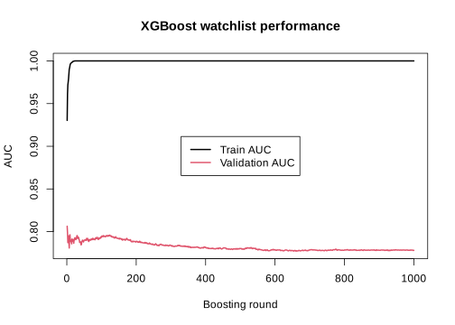{#fig-watchlist-1000-r fig-alt="Line plot of training and validation AUC over 1000 boosting rounds. Training AUC rises quickly to 1.0 and stays there, while validation AUC stays flat and noisy in a lower band throughout."}

## Python

``` python
evals_result = {}
model_xgboost = xgb.train(param, dtrain, num_boost_round=1000, evals=watchlist,
                           evals_result=evals_result, verbose_eval=False)

log = pd.DataFrame({
    "iter": range(1, 1001),
    "train_auc": evals_result["train"]["auc"],
    "validation_auc": evals_result["validation"]["auc"],
})
print(log)

import matplotlib.pyplot as plt

plt.figure(figsize=(7, 5))
plt.plot(log["iter"], log["train_auc"], label="Train AUC")
plt.plot(log["iter"], log["validation_auc"], label="Validation AUC")
plt.xlabel("Boosting round")
plt.ylabel("AUC")
plt.title("XGBoost watchlist performance")
plt.legend(loc="center")
plt.savefig("images/01-watchlist-1000-py.svg")
```

```
     iter  train_auc  validation_auc
0       1   0.912003        0.785068
1       2   0.941811        0.814951
2       3   0.954426        0.808824
3       4   0.960069        0.811275
4       5   0.963119        0.811934
..    ...        ...             ...
995   996   1.000000        0.795437
996   997   1.000000        0.795060
997   998   1.000000        0.795437
998   999   1.000000        0.795060
999  1000   1.000000        0.795437

[1000 rows x 3 columns]
```

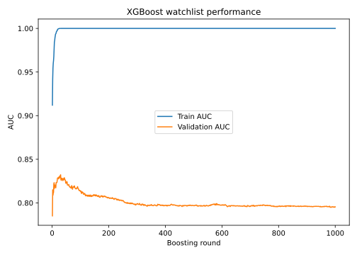{#fig-watchlist-1000-py fig-alt="Line plot of training and validation AUC over 1000 boosting rounds. Training AUC rises quickly to 1.0 and stays there, while validation AUC stays flat and noisy in a lower band throughout."}
:::

Similar story here, after a relatively small number of rounds of boosting, the model starts fitting the training data almost perfectly, but there is no real further improvement in the validation curve, a big sign of overfitting. In R, the validation AUC on this split reaches its best value already at round 1 and never clearly beats that level again over the remaining 999 rounds. In Python, validation keeps finding small gains for a while longer, peaking around round 30, before it plateaus and fluctuates without any further reliable improvement for the rest of the run. In both languages, training AUC keeps climbing all the way to 1.0 long after validation has stopped improving. So we should basically stop boosting very early, long before round 1000.

::: panel-tabset
## R

``` r
model_xgboost <- xgb.train(params = param, data = dtrain, nrounds = 8, evals = watchlist)
```

```
[1]	train-auc:0.930325	validation-auc:0.806336
[2]	train-auc:0.961191	validation-auc:0.798531
[3]	train-auc:0.971973	validation-auc:0.787144
[4]	train-auc:0.975291	validation-auc:0.788246
[5]	train-auc:0.979314	validation-auc:0.795133
[6]	train-auc:0.984613	validation-auc:0.786777
[7]	train-auc:0.990280	validation-auc:0.780808
[8]	train-auc:0.991750	validation-auc:0.792195
```

## Python

``` python
model_xgboost = xgb.train(param, dtrain, num_boost_round=8, evals=watchlist)
```

```
[0]	train-auc:0.91200	validation-auc:0.78507
[1]	train-auc:0.94181	validation-auc:0.81495
[2]	train-auc:0.95443	validation-auc:0.80882
[3]	train-auc:0.96007	validation-auc:0.81127
[4]	train-auc:0.96312	validation-auc:0.81193
[5]	train-auc:0.96796	validation-auc:0.82155
[6]	train-auc:0.97513	validation-auc:0.82315
[7]	train-auc:0.98427	validation-auc:0.81655
```
:::

## Early stopping

So far we saw that when the number of boosting rounds becomes too large, the training performance may continue to improve while the validation performance stops improving. This is a classical sign of overfitting. One possible solution is to inspect the validation curve manually and choose a suitable number of rounds by eye. However, in practice, XGBoost provides a much more convenient tool for this problem and is called early stopping.

The idea of early stopping is simple. We allow the model to train for a fairly large number of boosting rounds, but we tell XGBoost to stop automatically once the validation performance has not improved for a certain number of rounds. In this way, the algorithm itself can decide when further boosting is no longer helpful. This is often much more practical than choosing the number of rounds manually, and it is one of the most useful features in real-world XGBoost workflows.

To use early stopping, we keep the validation set in the watchlist, set a large upper bound for the number of rounds, and add an `early_stopping_rounds` argument.

::: panel-tabset
## R

``` r
model_xgboost_es <- xgb.train(
  params = param,
  data = dtrain,
  nrounds = 1000,
  evals = watchlist,
  early_stopping_rounds = 20,
  verbose = 1
)
```

```
Multiple eval metrics are present. Will use validation_auc for early stopping.
Will train until validation_auc hasn't improved in 20 rounds.

[1]	train-auc:0.930325	validation-auc:0.806336
[2]	train-auc:0.961191	validation-auc:0.798531
[3]	train-auc:0.971973	validation-auc:0.787144
[4]	train-auc:0.975291	validation-auc:0.788246
[5]	train-auc:0.979314	validation-auc:0.795133
[6]	train-auc:0.984613	validation-auc:0.786777
[7]	train-auc:0.990280	validation-auc:0.780808
[8]	train-auc:0.991750	validation-auc:0.792195
[9]	train-auc:0.994201	validation-auc:0.796327
[10]	train-auc:0.996243	validation-auc:0.790634
[11]	train-auc:0.996794	validation-auc:0.788430
[12]	train-auc:0.997304	validation-auc:0.790083
[13]	train-auc:0.997713	validation-auc:0.788246
[14]	train-auc:0.998162	validation-auc:0.785675
[15]	train-auc:0.998305	validation-auc:0.791368
[16]	train-auc:0.998509	validation-auc:0.788613
[17]	train-auc:0.999347	validation-auc:0.789164
[18]	train-auc:0.999387	validation-auc:0.790817
[19]	train-auc:0.999489	validation-auc:0.790817
[20]	train-auc:0.999694	validation-auc:0.786410
Stopping. Best iteration:
[21]	train-auc:0.999735	validation-auc:0.790266
```

## Python

``` python
model_xgboost_es = xgb.train(
    param, dtrain, num_boost_round=1000, evals=watchlist,
    early_stopping_rounds=20, verbose_eval=True
)
```

```
[0]	train-auc:0.91200	validation-auc:0.78507
[1]	train-auc:0.94181	validation-auc:0.81495
[2]	train-auc:0.95443	validation-auc:0.80882
[3]	train-auc:0.96007	validation-auc:0.81127
[4]	train-auc:0.96312	validation-auc:0.81193
[5]	train-auc:0.96796	validation-auc:0.82155
[6]	train-auc:0.97513	validation-auc:0.82315
[7]	train-auc:0.98427	validation-auc:0.81655
[8]	train-auc:0.98592	validation-auc:0.81938
[9]	train-auc:0.98912	validation-auc:0.82051
[10]	train-auc:0.99137	validation-auc:0.82014
...
[27]	train-auc:1.00000	validation-auc:0.83088
[28]	train-auc:1.00000	validation-auc:0.83164
[29]	train-auc:1.00000	validation-auc:0.83220
[30]	train-auc:1.00000	validation-auc:0.82636
...
[48]	train-auc:1.00000	validation-auc:0.82240
[49]	train-auc:1.00000	validation-auc:0.82259
```
:::

Here, `early_stopping_rounds = 20` means that training will stop if the validation AUC does not improve for 20 consecutive boosting rounds. So the model is allowed to continue as long as the validation performance keeps improving, but once improvement has stalled for long enough, training is terminated automatically. Note that the R and Python runs land on different "best" rounds here (R on this split finds its peak essentially immediately, Python keeps finding small gains for close to 30 rounds): this is expected, since the two languages use different random number generators, so the train/validation/test split is not the same row-for-row in R and in Python, even with matching seeds. The overall pattern, training saturating near 1.0 while validation plateaus and fluctuates, is the same in both.

After fitting, we can inspect the best iteration and the best validation score found during training:

::: panel-tabset
## R

``` r
attr(model_xgboost_es, "early_stop")$best_iteration
attr(model_xgboost_es, "early_stop")$best_score
```

```
[1] 1
validation-auc
     0.8063361
```

## Python

``` python
print(model_xgboost_es.best_iteration)
print(model_xgboost_es.best_score)
```

```
29
0.8322021116138764
```
:::

The value stored in `best_iteration` tells us at which boosting round the best validation performance was achieved. This is usually a much better and more objective choice than simply picking a round by visual inspection. The `best_score` gives the corresponding validation metric value.

We can also look at the evaluation log as before:

::: panel-tabset
## R

``` r
log_es <- attr(model_xgboost_es, "evaluation_log")

head(log_es)
tail(log_es)
```

```
    iter train_auc validation_auc
   <num>     <num>          <num>
1:     1 0.9303247      0.8063361
2:     2 0.9611905      0.7985308
3:     3 0.9719726      0.7871442
4:     4 0.9752910      0.7882461
5:     5 0.9793139      0.7951331
6:     6 0.9846130      0.7867769
    iter train_auc validation_auc
1:    16 0.9985093      0.7886134
2:    17 0.9993465      0.7891644
3:    18 0.9993874      0.7908173
4:    19 0.9994895      0.7908173
5:    20 0.9996937      0.7864096
6:    21 0.9997345      0.7902663
```

## Python

``` python
evals_result_es = {}
model_xgboost_es = xgb.train(
    param, dtrain, num_boost_round=1000, evals=watchlist,
    early_stopping_rounds=20, verbose_eval=False, evals_result=evals_result_es
)
n_rounds_es = len(evals_result_es["train"]["auc"])
log_es = pd.DataFrame({
    "iter": range(1, n_rounds_es + 1),
    "train_auc": evals_result_es["train"]["auc"],
    "validation_auc": evals_result_es["validation"]["auc"],
})
print(log_es.head(6))
print(log_es.tail(6))
```

```
   iter  train_auc  validation_auc
0     1   0.912003        0.785068
1     2   0.941811        0.814951
2     3   0.954426        0.808824
3     4   0.960069        0.811275
4     5   0.963119        0.811934
5     6   0.967962        0.821550
    iter  train_auc  validation_auc
44    45        1.0        0.826169
45    46        1.0        0.826357
46    47        1.0        0.825603
47    48        1.0        0.822775
48    49        1.0        0.822398
49    50        1.0        0.822587
```
:::

And visualize the training and validation performance over the boosting rounds:

::: panel-tabset
## R

``` r
svg("images/02-watchlist-earlystop-r.svg", width = 7, height = 5)
matplot(
  log_es$iter,
  cbind(log_es$train_auc, log_es$validation_auc),
  type = "l", lty = 1, lwd = 2,
  xlab = "Boosting round",
  ylab = "AUC",
  main = "XGBoost with early stopping"
)

legend(
  "center",
  legend = c("Train AUC", "Validation AUC"),
  col = 1:2,
  lty = 1,
  lwd = 2
)
```

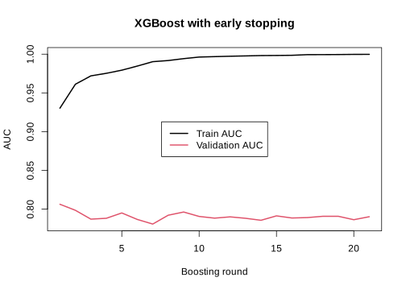{#fig-earlystop-r fig-alt="Line plot of training and validation AUC across the early-stopped boosting rounds. Training AUC saturates near 1.0 within a few rounds while validation AUC stays flat and noisy."}

## Python

``` python
plt.figure(figsize=(7, 5))
plt.plot(log_es["iter"], log_es["train_auc"], label="Train AUC")
plt.plot(log_es["iter"], log_es["validation_auc"], label="Validation AUC")
plt.xlabel("Boosting round")
plt.ylabel("AUC")
plt.title("XGBoost with early stopping")
plt.legend(loc="center")
plt.savefig("images/02-watchlist-earlystop-py.svg")
```

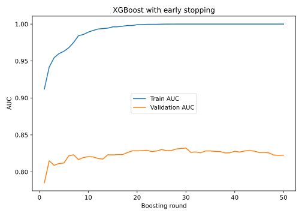{#fig-earlystop-py fig-alt="Line plot of training and validation AUC across the early-stopped boosting rounds. Training AUC saturates near 1.0 within about 30 rounds while validation AUC rises gradually then flattens and gets noisy."}
:::

What we usually expect to see is that the training AUC continues to increase or stays high, while the validation AUC improves only up to a certain point. Early stopping then prevents the model from continuing far beyond that useful region. In this way, it provides an automatic balance between learning enough from the data and stopping before overfitting becomes too severe.

For practical use, early stopping is often one of the best ways to choose the effective number of boosting rounds. Instead of guessing the number of rounds in advance, we can set a large upper bound and let the validation performance decide how far the model should actually go.

# Predict on test set

Now let's see how the model performs on the test data:

::: panel-tabset
## R

``` r
# Predict probabilities on the test set
pred_test <- predict(model_xgboost_es, newdata = dtest)

# Compute AUC on the test set
library(pROC)

auc_test <- auc(response = y_test, predictor = pred_test)
auc_test
```

```
Area under the curve: 0.8178
```

## Python

``` python
from sklearn.metrics import roc_auc_score

# Predict probabilities on the test set
pred_test = model_xgboost_es.predict(dtest)

# Compute AUC on the test set
auc_test = roc_auc_score(y_test, pred_test)
auc_test
```

```
0.8157366519470093
```
:::

This is a good prediction performance and gives us a natural point to move on. So far, we have mainly evaluated the model using AUC. This is very useful because it tells us how well the model separates the two classes overall across all possible thresholds. However, in practice, a binary classification model usually returns predicted probabilities, and at some point we must decide how those probabilities should be converted into class labels. In other words, we need to choose a classification threshold.

## Prediction and classification threshold

If the model predicts a probability of 0.80 for diabetes, we would usually classify that patient as positive. But what about a probability of 0.55, or 0.40? The answer depends on the threshold we choose. A common default is 0.5, meaning that observations with predicted probability above 0.5 are classified as positive, while those below 0.5 are classified as negative. But this is not always the best choice. In clinical settings, for example, we may prefer a lower threshold if missing a true positive is especially costly.

This means that there are really two related but different questions:

1.  How well does the model rank positive cases above negative cases overall?\
    This is what AUC measures.

2.  How well does the model perform once we choose a specific threshold and turn probabilities into class labels?\
    This is where measures such as sensitivity, specificity, precision, recall, and the confusion matrix become useful.

### Predicted probabilities on the test set

Since we used a logistic binary objective, `predict()` returns predicted probabilities for the positive class in both languages.

::: panel-tabset
## R

``` r
pred_test <- predict(model_xgboost_es, newdata = dtest)

head(pred_test)
range(pred_test)
```

```
[1] 0.4739324 0.4149916 0.2648273 0.3665215 0.3665215 0.2909205
[1] 0.2648273 0.5317002
```

## Python

``` python
pred_test = model_xgboost_es.predict(dtest)

print(pred_test[:6])
print(pred_test.min(), pred_test.max())
```

```
[0.07020453 0.7954392  0.02413368 0.9869982  0.2648263  0.23358226]
0.00023298075 0.99789906
```
:::

These values lie between 0 and 1. A value close to 1 means that the model considers the patient likely to belong to the positive diabetes class, while a value close to 0 means the opposite.

### Converting probabilities to class labels

Let us start with the most common threshold, 0.5. If the predicted probability is at least 0.5, we classify the patient as positive. Otherwise, we classify the patient as negative.

::: panel-tabset
## R

``` r
threshold <- 0.5

pred_class <- ifelse(pred_test >= threshold, 1, 0)

head(pred_class)
```

```
[1] 0 0 0 0 0 0
```

## Python

``` python
threshold = 0.5

pred_class = (pred_test >= threshold).astype(int)

print(pred_class[:6])
```

```
[0 1 0 1 0 0]
```
:::

Here, `pred_class` contains the predicted class labels, while `pred_test` contains the underlying predicted probabilities.

### Confusion matrix

A confusion matrix compares the predicted classes with the true classes. It is one of the most basic tools for evaluating a classifier at a fixed threshold.

::: panel-tabset
## R

``` r
cm <- table(
  Predicted = pred_class,
  Observed = y_test
)

cm
```

```
         Observed
Predicted   0   1
        0 100  28
        1   6  19
```

## Python

``` python
from sklearn.metrics import confusion_matrix

cm = confusion_matrix(y_test, pred_class, labels=[0, 1])
cm
```

```
array([[92, 14],
       [23, 24]])
```
:::

This table shows how many observations were:

-   true negatives: predicted negative and actually negative
-   false positives: predicted positive but actually negative
-   false negatives: predicted negative but actually positive
-   true positives: predicted positive and actually positive

To make this easier to work with, we can extract the four numbers explicitly.

::: panel-tabset
## R

``` r
tn <- cm["0", "0"]
fp <- cm["1", "0"]
fn <- cm["0", "1"]
tp <- cm["1", "1"]

tn
fp
fn
tp
```

```
[1] 100
[1] 6
[1] 28
[1] 19
```

## Python

``` python
tn, fp, fn, tp = cm.ravel()

print(tn)
print(fp)
print(fn)
print(tp)
```

```
92
14
23
24
```
:::

Note that `sklearn`'s `confusion_matrix` orders its 2x2 output as `[[tn, fp], [fn, tp]]` by default, which is why the Python code reads the four counts directly with `.ravel()`, whereas the R code pulls them out of the named `table()` by row/column label.

### Sensitivity, specificity, precision, recall, and accuracy

Once we have the confusion matrix, we can compute several useful performance measures.

::: panel-tabset
## R

``` r
accuracy <- (tp + tn) / (tp + tn + fp + fn)

sensitivity <- tp / (tp + fn)
specificity <- tn / (tn + fp)

precision <- tp / (tp + fp)
recall <- sensitivity

f1 <- 2 * precision * recall / (precision + recall)

metrics_05 <- data.frame(
  threshold = threshold,
  accuracy = accuracy,
  sensitivity = sensitivity,
  specificity = specificity,
  precision = precision,
  recall = recall,
  f1 = f1
)

metrics_05
```

```
  threshold  accuracy sensitivity specificity precision    recall        f1
1       0.5 0.7777778   0.4042553   0.9433962      0.76 0.4042553 0.5277778
```

## Python

``` python
accuracy = (tp + tn) / (tp + tn + fp + fn)

sensitivity = tp / (tp + fn)
specificity = tn / (tn + fp)

precision = tp / (tp + fp)
recall = sensitivity

f1 = 2 * precision * recall / (precision + recall)

metrics_05 = pd.DataFrame([{
    "threshold": threshold, "accuracy": accuracy, "sensitivity": sensitivity,
    "specificity": specificity, "precision": precision, "recall": recall, "f1": f1
}])

metrics_05
```

```
   threshold  accuracy  sensitivity  specificity  precision    recall        f1
0        0.5   0.75817     0.510638     0.867925   0.631579  0.510638  0.564706
```
:::

These quantities tell us different things:

-   Accuracy: the overall fraction of correctly classified observations
-   Sensitivity: among the truly positive patients, how many were correctly detected?
-   Specificity: among the truly negative patients, how many were correctly classified as negative?
-   Precision: among the patients predicted as positive, how many were actually positive?
-   Recall: same as sensitivity
-   F1 score: a balance between precision and recall

In a clinical setting, sensitivity and specificity are often especially important. A model with high sensitivity misses fewer true cases, while a model with high specificity produces fewer false alarms.

### Trying different thresholds

The threshold does not have to be 0.5. To see how the classification changes, let us compare a few thresholds.

::: panel-tabset
## R

``` r
get_metrics <- function(prob, truth, threshold) {
  pred <- ifelse(prob >= threshold, 1, 0)
  cm <- table(
    factor(pred, levels = c(0, 1)),
    factor(truth, levels = c(0, 1))
  )

  tn <- cm["0", "0"]
  fp <- cm["1", "0"]
  fn <- cm["0", "1"]
  tp <- cm["1", "1"]

  accuracy <- (tp + tn) / (tp + tn + fp + fn)
  sensitivity <- tp / (tp + fn)
  specificity <- tn / (tn + fp)
  precision <- ifelse((tp + fp) == 0, NA, tp / (tp + fp))
  recall <- sensitivity
  f1 <- ifelse(is.na(precision) || (precision + recall) == 0,
               NA,
               2 * precision * recall / (precision + recall))

  data.frame(
    threshold = threshold,
    accuracy = accuracy,
    sensitivity = sensitivity,
    specificity = specificity,
    precision = precision,
    recall = recall,
    f1 = f1
  )
}

threshold_grid <- c(0.3, 0.5, 0.7)

threshold_results <- do.call(
  rbind,
  lapply(threshold_grid, function(th) get_metrics(pred_test, y_test, th))
)

threshold_results
```

```
  threshold  accuracy sensitivity specificity precision    recall        f1
1       0.3 0.7058824   0.8297872   0.6509434 0.5131579 0.8297872 0.6341463
2       0.5 0.7777778   0.4042553   0.9433962 0.7600000 0.4042553 0.5277778
3       0.7 0.6928105   0.0000000   1.0000000        NA 0.0000000        NA
```

## Python

``` python
import numpy as np

def get_metrics(prob, truth, threshold):
    pred = (prob >= threshold).astype(int)
    cm = confusion_matrix(truth, pred, labels=[0, 1])
    tn, fp, fn, tp = cm.ravel()
    accuracy = (tp + tn) / (tp + tn + fp + fn)
    sensitivity = tp / (tp + fn)
    specificity = tn / (tn + fp)
    precision = np.nan if (tp + fp) == 0 else tp / (tp + fp)
    recall = sensitivity
    f1 = np.nan if np.isnan(precision) or (precision + recall) == 0 else 2 * precision * recall / (precision + recall)
    return {"threshold": threshold, "accuracy": accuracy, "sensitivity": sensitivity,
            "specificity": specificity, "precision": precision, "recall": recall, "f1": f1}

threshold_grid = [0.3, 0.5, 0.7]
threshold_results = pd.DataFrame([get_metrics(pred_test, y_test, th) for th in threshold_grid])

threshold_results
```

```
   threshold  accuracy  sensitivity  specificity  precision    recall        f1
0        0.3  0.732026     0.659574     0.764151   0.553571  0.659574  0.601942
1        0.5  0.758170     0.510638     0.867925   0.631579  0.510638  0.564706
2        0.7  0.764706     0.425532     0.915094   0.689655  0.425532  0.526316
```
:::

This helps us see the tradeoff:

-   Lower threshold: more patients are classified as positive, which often increases sensitivity but decreases specificity
-   Higher threshold: fewer patients are classified as positive, which often increases specificity but decreases sensitivity

So the "best" threshold depends on the goal of the analysis. If it is very important not to miss positive cases, a lower threshold may be better. If false positives are more costly, a higher threshold may be preferred.

### ROC curve

The ROC curve summarizes this threshold tradeoff across all possible thresholds. That is one reason it is so widely used.

::: panel-tabset
## R

``` r
library(pROC)

roc_obj <- roc(response = y_test, predictor = pred_test)

svg("images/03-roc-test-r.svg", width = 6, height = 6)
plot(roc_obj,
     main = "ROC curve on the test set")

auc(roc_obj)
```

```
Area under the curve: 0.8178
```

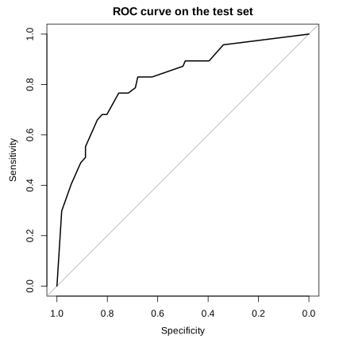{#fig-roc-r fig-alt="ROC curve for the test set, bowing well above the diagonal reference line, with an area under the curve of about 0.82."}

## Python

``` python
from sklearn.metrics import roc_curve

fpr, tpr, _ = roc_curve(y_test, pred_test)

plt.figure(figsize=(6, 6))
plt.plot(fpr, tpr)
plt.plot([0, 1], [0, 1], linestyle="--", color="gray")
plt.xlabel("False positive rate")
plt.ylabel("True positive rate")
plt.title("ROC curve on the test set")
plt.savefig("images/03-roc-test-py.svg")

roc_auc_score(y_test, pred_test)
```

```
0.8157366519470093
```

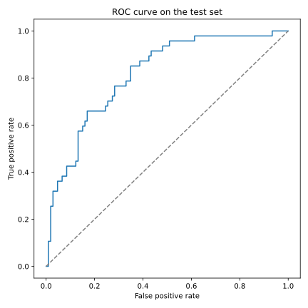{#fig-roc-py fig-alt="ROC curve for the test set, bowing well above the diagonal reference line, with an area under the curve of about 0.82."}
:::

The ROC curve shows the tradeoff between sensitivity and 1 - specificity across all thresholds. The AUC is simply the area under this curve. A larger AUC means that the model is better at ranking positive cases above negative cases overall.

### A small visual comparison of thresholds

We can also visualize how some of the threshold-based metrics change.

::: panel-tabset
## R

``` r
svg("images/04-threshold-metrics-r.svg", width = 7, height = 5)
matplot(
  threshold_results$threshold,
  threshold_results[, c("sensitivity", "specificity", "precision")],
  type = "b", pch = 1:3, lty = 1,
  xlab = "Threshold",
  ylab = "Metric value",
  main = "Effect of threshold on classification metrics"
)

legend("center",
       legend = c("Sensitivity", "Specificity", "Precision"),
       pch = 1:3,
       lty = 1,
       bty = "n")
```

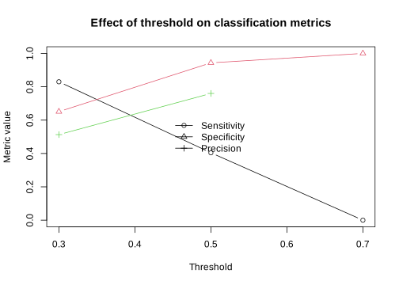{#fig-threshold-r fig-alt="Line plot of sensitivity, specificity, and precision across thresholds 0.3, 0.5, and 0.7. Sensitivity falls and specificity rises as the threshold increases, while precision rises then falls slightly."}

## Python

``` python
plt.figure(figsize=(7, 5))
plt.plot(threshold_results["threshold"], threshold_results["sensitivity"], marker="o", label="Sensitivity")
plt.plot(threshold_results["threshold"], threshold_results["specificity"], marker="s", label="Specificity")
plt.plot(threshold_results["threshold"], threshold_results["precision"], marker="^", label="Precision")
plt.xlabel("Threshold")
plt.ylabel("Metric value")
plt.title("Effect of threshold on classification metrics")
plt.legend(loc="center", frameon=False)
plt.savefig("images/04-threshold-metrics-py.svg")
```

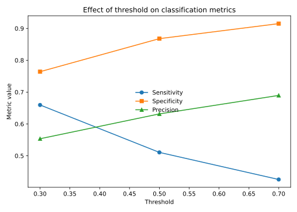{#fig-threshold-py fig-alt="Line plot of sensitivity, specificity, and precision across thresholds 0.3, 0.5, and 0.7. Sensitivity falls and specificity rises as the threshold increases, while precision rises then levels off."}
:::

This figure makes it easier to see that changing the threshold changes the practical behavior of the classifier, even though the underlying predicted probabilities stay exactly the same.

### Summary

Predicted probabilities and predicted classes are not the same thing. XGBoost gives us probabilities, but the final class labels depend on the threshold we choose. AUC evaluates how well the model separates the classes overall, while confusion matrices and related measures evaluate how the model behaves at one specific threshold.

So in practice, both views are useful. AUC gives a threshold-independent summary of discrimination, while threshold-based measures such as sensitivity, specificity, and precision help us understand the real classification consequences of the model in a practical setting.

# Cross-validation

So far, we have evaluated the model using one particular split of the data into training, validation, and test sets. This is a very useful starting point, but it also has an important limitation that is the result may depend on the exact split we happened to choose. If the validation set is unusually easy or unusually difficult, the estimated performance may be too optimistic or too pessimistic. Cross-validation helps reduce this dependence on a single split by repeatedly dividing the available training data into different parts and evaluating the model across these repeated splits.

The basic idea is the following. First, we set aside a final test set and do not touch it during model development. Then, on the remaining data, we perform cross-validation. In each fold, part of the remaining data is used for fitting and another part is used for validation. This gives us a more stable picture of how well the model is expected to generalize, and it is especially helpful when choosing the number of boosting rounds or comparing different parameter settings.

In XGBoost, cross-validation can be performed with `xgb.cv()` in R and `xgboost.cv()` in Python. This function repeatedly splits the supplied data into folds, trains the model, evaluates it on the held-out fold, and then summarizes the performance across folds for each boosting round.

## Setting aside the final test set

Before doing cross-validation, we first reserve a final test set. This test set will remain untouched until the end, and all model selection steps will be done only on the remaining data.

::: panel-tabset
## R

``` r
set.seed(123)

n <- nrow(x)
test_id <- sample(seq_len(n), size = round(0.20 * n))

x_test <- x[test_id, ]
y_test <- y[test_id]

x_cv <- x[-test_id, ]
y_cv <- y[-test_id]

# DMatrix objects
dtest <- xgb.DMatrix(data = x_test, label = y_test)
dcv   <- xgb.DMatrix(data = x_cv,   label = y_cv)

dim(x_cv)
dim(x_test)
```

```
[1] 614   8
[1] 154   8
```

## Python

``` python
rng = np.random.RandomState(123)
n = x.shape[0]
test_id = rng.choice(n, size=round(0.20 * n), replace=False)

cv_mask = np.ones(n, dtype=bool)
cv_mask[test_id] = False

x_test, y_test = x[test_id], y[test_id]
x_cv, y_cv = x[cv_mask], y[cv_mask]

# DMatrix objects
dtest = xgb.DMatrix(x_test, label=y_test, feature_names=feature_cols)
dcv = xgb.DMatrix(x_cv, label=y_cv, feature_names=feature_cols)

print(x_cv.shape)
print(x_test.shape)
```

```
(614, 8)
(154, 8)
```
:::

This means that the test set is removed first, and only the remaining data will be used inside cross-validation.

## Running cross-validation

We now define a simple parameter set and run cross-validation on the remaining data. Since this is still our first practical example, we keep the setup simple and use only the objective and evaluation metric.

::: panel-tabset
## R

``` r
param <- list(
  objective = "binary:logistic",
  eval_metric = "auc"
)

set.seed(123)

cv_xgboost <- xgb.cv(
  params = param,
  data = dcv,
  nrounds = 50,
  nfold = 5,
  verbose = 0
)
```

## Python

``` python
param = {"objective": "binary:logistic", "eval_metric": "auc"}

cv_xgboost = xgb.cv(param, dcv, num_boost_round=50, nfold=5, seed=123, verbose_eval=False)
```
:::

Here:

-   5 folds means that the non-test data is divided into 5 parts
-   in each round, 4 parts are used for fitting and 1 part is used for validation
-   this process is repeated so that each part serves once as validation
-   performance is averaged across folds for each boosting round

So instead of getting one validation AUC for each round, we now get an average validation AUC across the 5 folds.

## Looking at the cross-validation results

We can inspect the evaluation log directly. In Python, `xgboost.cv()` already returns this log as a pandas DataFrame.

::: panel-tabset
## R

``` r
head(cv_xgboost$evaluation_log)
```

```
    iter train_auc_mean train_auc_std test_auc_mean test_auc_std
   <int>          <num>         <num>         <num>        <num>
1:     1      0.9221252   0.012640079     0.7545127   0.04358570
2:     2      0.9493364   0.003153675     0.7794028   0.04510781
3:     3      0.9610186   0.005534729     0.7879194   0.04799712
4:     4      0.9683732   0.004332334     0.7983577   0.04097258
5:     5      0.9747521   0.005093734     0.7979714   0.04625883
6:     6      0.9805941   0.003998551     0.8009105   0.04784618
```

## Python

``` python
cv_xgboost.head(6)
```

```
   train-auc-mean  train-auc-std  test-auc-mean  test-auc-std
0        0.921344       0.009647       0.747017      0.018115
1        0.953606       0.009334       0.774675      0.027859
2        0.964113       0.005122       0.786671      0.033916
3        0.970943       0.004126       0.789457      0.030525
4        0.975921       0.002983       0.790878      0.031921
5        0.980026       0.002698       0.795882      0.028795
```
:::

This table contains columns

-   `iter` / row index: boosting round
-   `train_auc_mean` / `train-auc-mean`: average training AUC across folds
-   `train_auc_std` / `train-auc-std`: standard deviation of training AUC across folds
-   `test_auc_mean` / `test-auc-mean`: average validation AUC across folds
-   `test_auc_std` / `test-auc-std`: standard deviation of validation AUC across folds

The most important column for model selection is usually the mean validation (test) AUC, because this gives the average validation performance across folds.

## Best number of rounds from cross-validation

A very common use of cross-validation in XGBoost is to decide how many boosting rounds we should keep. We can find the round with the highest average validation AUC like this:

::: panel-tabset
## R

``` r
best_iter <- cv_xgboost$evaluation_log$iter[
  which.max(cv_xgboost$evaluation_log$test_auc_mean)
]

best_auc <- max(cv_xgboost$evaluation_log$test_auc_mean)

best_iter
best_auc
```

```
[1] 13
[1] 0.8134981
```

## Python

``` python
best_iter = int(cv_xgboost["test-auc-mean"].idxmax()) + 1
best_auc = cv_xgboost["test-auc-mean"].max()

print(best_iter)
print(best_auc)
```

```
12
0.7983158825366117
```
:::

This gives us the boosting round that performed best on average across the validation folds (Python's index is 0-based, so we add 1 to express it as a round count like R's).

## Refit the model on all non-test data

Once cross-validation has told us a reasonable number of boosting rounds, we can fit a final model on all the non-test data using that number of rounds.

::: panel-tabset
## R

``` r
final_model <- xgb.train(
  params = param,
  data = dcv,
  nrounds = best_iter
)

final_model
```

```
##### xgb.Booster
call:
  xgb.train(params = param, data = dcv, nrounds = best_iter)
# of features: 8
# of rounds:  13
```

## Python

``` python
final_model = xgb.train(param, dcv, num_boost_round=best_iter)

print(f"# of features: {final_model.num_features()}")
print(f"# of rounds: {final_model.num_boosted_rounds()}")
```

```
# of features: 8
# of rounds: 12
```
:::

This model is now trained using all available development data, while the choice of the number of rounds was informed by cross-validation.

## Evaluate on the untouched test set

Now we can finally evaluate the fitted model on the test set that we set aside at the very beginning.

::: panel-tabset
## R

``` r
pred_test <- predict(final_model, newdata = dtest)

auc_test <- auc(response = y_test, predictor = pred_test)
auc_test
```

```
Area under the curve: 0.8243
```

## Python

``` python
pred_test = final_model.predict(dtest)

auc_test = roc_auc_score(y_test, pred_test)
auc_test
```

```
0.8633261494252874
```
:::

This test AUC is our final external estimate within this chapter, because the test set was not used during cross-validation or training of the folds.

## Early stopping inside cross-validation

In practice, we often combine cross-validation with early stopping so that XGBoost stops automatically when the validation performance is no longer improving.

::: panel-tabset
## R

``` r
set.seed(123)

cv_xgboost_es <- xgb.cv(
  params = param,
  data = dcv,
  nrounds = 500,
  nfold = 5,
  early_stopping_rounds = 20,
  verbose = 1
)
```

```
Multiple eval metrics are present. Will use test_auc for early stopping.
Will train until test_auc hasn't improved in 20 rounds.

[1]	train-auc:0.922125±0.012640	test-auc:0.754513±0.043586
[2]	train-auc:0.949336±0.003154	test-auc:0.779403±0.045108
[3]	train-auc:0.961019±0.005535	test-auc:0.787919±0.047997
...
[12]	train-auc:0.995019±0.000443	test-auc:0.813035±0.040757
[13]	train-auc:0.996419±0.000689	test-auc:0.813498±0.040225
...
[32]	train-auc:1.000000±0.000000	test-auc:0.801693±0.037680
Stopping. Best iteration:
[33]	train-auc:1.000000±0.000000	test-auc:0.801233±0.038685
```

## Python

``` python
cv_xgboost_es = xgb.cv(param, dcv, num_boost_round=500, nfold=5, seed=123,
                        early_stopping_rounds=20, verbose_eval=True)
```

```
[0]	train-auc:0.92134+0.00965	test-auc:0.74702+0.01812
[1]	train-auc:0.95361+0.00933	test-auc:0.77468+0.02786
[2]	train-auc:0.96411+0.00512	test-auc:0.78667+0.03392
...
[11]	train-auc:0.99444+0.00189	test-auc:0.79832+0.03477
[12]	train-auc:0.99582+0.00129	test-auc:0.79776+0.03347
...
[30]	train-auc:0.99999+0.00001	test-auc:0.78719+0.04082
[31]	train-auc:1.00000+0.00000	test-auc:0.78612+0.03978
```
:::

This is often more convenient than manually scanning through all rounds, because XGBoost will stop once performance has stopped improving for a specified number of rounds.

# Tuning

In order to build a good predictive model, we need three things. First, we want the model to learn meaningful patterns from the training data. If it cannot even fit the training data reasonably well, then it is too simple and will fail to capture the structure in the problem. This is usually referred to as high bias, or underfitting.

Second, we do not want the model to become too closely attached to the training data. A model that keeps chasing small details, random fluctuations, or noise in the training set may appear to perform extremely well there, but this often comes at the cost of poor generalization. This problem is called high variance, or overfitting.

Third, and most importantly, we want the model to perform well on unseen data. After all, the real purpose of a predictive model is not to memorize the samples it has already seen, but to make accurate predictions for new observations. Good tuning is therefore always a balance between bias and variance: the model should be flexible enough to learn the important signal, but not so flexible that it starts fitting noise.

Luckily XGBoost gives a number of parameters which we can use to tune the model and find a good balance between bias and variance. This process is called hyperparameter tuning. Here we try to understand and tune a few of the most important parameters of XGBoost. The parameter names below are identical in R and Python.

## `nrounds` / `num_boost_round`

We have already seen this parameter in earlier examples. It controls how many boosting rounds are performed, or in other words, how many trees are added to the model. Since XGBoost builds the model step by step, with each new tree adding a correction to the current predictions, this parameter determines how many such corrections we allow the model to make.

If it is too small, the model may stop before it has learned enough from the training data. In that case, the model may be too simple and underfit. If it is too large, the model may continue adding corrections even after the main signal has already been learned, and it may start fitting noise in the training data instead. In that case, the model may overfit.

This means that the number of boosting rounds is one of the most direct parameters controlling model complexity. Too few rounds can give high bias, while too many rounds can give high variance. For this reason, the choice of the number of rounds is usually not made in isolation, but together with validation monitoring, cross-validation, or early stopping.

In the cross-validation part we have seen how to tune this parameter.

## `eta`

Another very important parameter is `eta`, also known as the learning rate. While the number of rounds tells us how many trees we add, `eta` controls how much each new tree is allowed to contribute when it is added to the model. In other words, it scales the correction made by each boosting step.

If `eta` is large, each tree is allowed to make a stronger correction to the current predictions. This can make learning faster, because the model can improve quickly in a small number of rounds. However, it also makes the fitting process more aggressive, which can increase the risk of overfitting. If `eta` is small, each tree contributes only a small correction. This makes the learning process slower and more conservative, but it often leads to a more stable model that generalizes better.

This means that `eta` and the number of rounds are closely connected. A small value of `eta` usually requires a larger number of rounds, because the model is learning in smaller steps and therefore needs more rounds to reach a good solution. A larger value of `eta` usually requires fewer rounds, because each tree is making a stronger update. For this reason, these two parameters are often considered together rather than separately.

From the perspective of bias and variance, a very large `eta` can make the model too aggressive and unstable, while a very small `eta` can make the model unnecessarily slow and may require many more boosting rounds. In practice, smaller values such as `0.1`, `0.05`, or even lower are often used together with cross-validation and early stopping to find a good balance between learning speed and generalization.

::: panel-tabset
## R

``` r
# --------------------------------------------------
# Define a few eta values to compare
# --------------------------------------------------
eta_values <- c(0.01, 0.05, 0.10, 0.30)

# We keep the same maximum number of rounds for all models
nrounds_fixed <- 100

# Store results here
cv_results <- vector("list", length(eta_values))
names(cv_results) <- paste0("eta_", eta_values)

# --------------------------------------------------
# Run CV for each eta
# --------------------------------------------------
set.seed(123)

for (i in seq_along(eta_values)) {

  eta_i <- eta_values[i]

  param_i <- list(
    objective = "binary:logistic",
    eval_metric = "auc",
    eta = eta_i
  )

  cv_fit <- xgb.cv(
    params = param_i,
    data = dcv,
    nrounds = nrounds_fixed,
    nfold = 5,
    verbose = 0
  )

  tmp <- cv_fit$evaluation_log
  tmp$eta <- eta_i

  cv_results[[i]] <- tmp
}

cv_results_df <- do.call(rbind, cv_results)

# --------------------------------------------------
# Plot validation AUC across rounds for each eta
# --------------------------------------------------
svg("images/05-eta-cv-r.svg", width = 7, height = 5)
plot(NULL,
     xlim = c(1, nrounds_fixed),
     ylim = range(cv_results_df$test_auc_mean),
     xlab = "Boosting round",
     ylab = "Cross-validated AUC",
     main = "Effect of eta on CV performance")

eta_unique <- sort(unique(cv_results_df$eta))
line_types <- 1:length(eta_unique)

for (j in seq_along(eta_unique)) {
  eta_j <- eta_unique[j]
  dat_j <- cv_results_df[cv_results_df$eta == eta_j, ]

  lines(dat_j$iter, dat_j$test_auc_mean,
        lwd = 2, lty = line_types[j],col=line_types[j])
}

legend("bottomright",
       legend = paste("eta =", eta_unique),
       lty = line_types,col=line_types,
       lwd = 2,
       bty = "n")
```

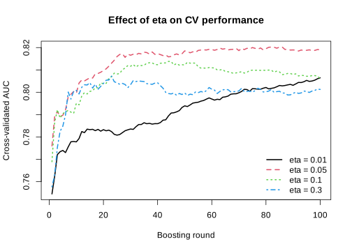{#fig-eta-r fig-alt="Line plot of cross-validated AUC across 100 boosting rounds for four eta values. eta=0.3 rises fastest then plateaus early at a lower level; eta=0.05 rises a little slower but reaches the highest overall AUC; eta=0.01 rises slowest and is still climbing at round 100."}

## Python

``` python
# --------------------------------------------------
# Define a few eta values to compare
# --------------------------------------------------
eta_values = [0.01, 0.05, 0.10, 0.30]

# We keep the same maximum number of rounds for all models
nrounds_fixed = 100

cv_results = []
for eta_i in eta_values:
    param_i = {"objective": "binary:logistic", "eval_metric": "auc", "eta": eta_i}
    cv_fit = xgb.cv(param_i, dcv, num_boost_round=nrounds_fixed, nfold=5, seed=123, verbose_eval=False)
    cv_fit = cv_fit.reset_index().rename(columns={"index": "iter"})
    cv_fit["iter"] = cv_fit["iter"] + 1
    cv_fit["eta"] = eta_i
    cv_results.append(cv_fit)

cv_results_df = pd.concat(cv_results, ignore_index=True)

# --------------------------------------------------
# Plot validation AUC across rounds for each eta
# --------------------------------------------------
plt.figure(figsize=(7, 5))
for eta_j in sorted(cv_results_df["eta"].unique()):
    sub = cv_results_df[cv_results_df["eta"] == eta_j]
    plt.plot(sub["iter"], sub["test-auc-mean"], linewidth=2, label=f"eta = {eta_j}")

plt.xlabel("Boosting round")
plt.ylabel("Cross-validated AUC")
plt.title("Effect of eta on CV performance")
plt.legend(loc="lower right", frameon=False)
plt.savefig("images/05-eta-cv-py.svg")
```

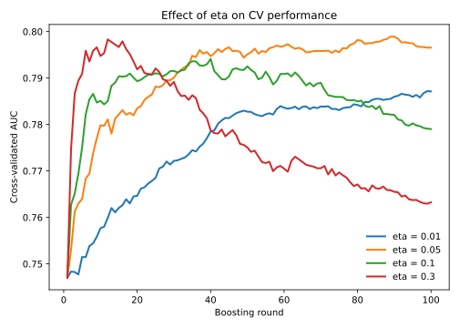{#fig-eta-py fig-alt="Line plot of cross-validated AUC across 100 boosting rounds for four eta values. eta=0.3 rises fastest then plateaus early at a lower level; eta=0.05 rises a little slower but reaches the highest overall AUC; eta=0.01 rises slowest and is still climbing at round 100."}
:::

This plot shows clearly that the learning rate `eta` affects not only the final performance, but also the speed of learning across boosting rounds. When `eta = 0.3`, the model improves very quickly in the first dozen or so rounds, reaches its peak validation AUC earliest of the four values tested, and then drifts down somewhat for the remaining rounds, a sign the model has already started overfitting with so few, large steps. A similar pattern is seen for `eta = 0.1`, which also improves rapidly and reaches its own peak a bit later than `eta = 0.3`, before it too drifts down by round 100.

For `eta = 0.05`, the improvement is slightly slower at the beginning, but it continues to rise for a longer period and eventually reaches the best overall validation performance among the values tested here (in both languages). In contrast, `eta = 0.01` learns much more slowly. Even after 100 rounds, the AUC is still improving gradually, which indicates that the model is taking very small steps and would likely need many more boosting rounds to reach its full potential.

So `eta = 0.05` appears to give the best balance, whereas `eta = 0.01` is likely too small for only 100 rounds, and `eta = 0.3` appears somewhat too aggressive. Please remember that `eta` should not be tuned in isolation, but together with the number of boosting rounds.

Often a very common practical choice is to begin with a smaller learning rate such as `eta = 0.05` or `0.1`, set the number of rounds fairly large, and use early stopping to find how many rounds are actually useful.

## `max_depth`

We have not seen `max_depth` in any of the examples yet. This parameter controls the maximum depth of each individual tree, that is, how many levels of splits a tree is allowed to grow before it must stop. Since deeper trees can create more detailed decision rules and more local regions in the predictor space, `max_depth` is one of the most important parameters controlling the complexity of each boosting step.

If `max_depth` is small, each tree remains simple and can only make broad and relatively coarse corrections to the current predictions. This often makes the model more stable and less likely to overfit, but it may also make it too rigid to capture more complicated patterns in the data. If `max_depth` is large, each tree can make much more detailed and localized corrections. This increases flexibility, but it also increases the risk that the model starts fitting noise or accidental patterns in the training data.

So while the number of rounds controls how many correction steps we allow, `max_depth` controls how complex each correction step is allowed to be. From the perspective of bias and variance, shallow trees tend to increase bias but reduce variance, while deeper trees reduce bias but can increase variance. For this reason, `max_depth` is often one of the first parameters to tune when building an XGBoost model.

::: panel-tabset
## R

``` r
depth_values <- 1:10
nrounds_fixed <- 100

depth_summary <- data.frame(
  max_depth = depth_values,
  train_auc = NA_real_,
  valid_auc = NA_real_
)

set.seed(123)

for (i in seq_along(depth_values)) {

  depth_i <- depth_values[i]

  param_i <- list(
    objective = "binary:logistic",
    eval_metric = "auc",
    eta = 0.05,
    max_depth = depth_i
  )

  cv_fit <- xgb.cv(
    params = param_i,
    data = dcv,
    nrounds = nrounds_fixed,
    nfold = 5,
    verbose = 0
  )

  last_row <- cv_fit$evaluation_log[nrounds_fixed, ]

  depth_summary$train_auc[i] <- last_row$train_auc_mean
  depth_summary$valid_auc[i] <- last_row$test_auc_mean
}

depth_summary

# --------------------------------------------------
# Plot training and validation AUC
# --------------------------------------------------
svg("images/06-depth-cv-r.svg", width = 7, height = 5)
plot(depth_summary$max_depth, depth_summary$train_auc,
     type = "b", pch = 16, lwd = 2,
     xlab = "max_depth",
     ylab = "AUC",
     ylim = range(c(depth_summary$train_auc, depth_summary$valid_auc)),
     main = "Effect of max_depth at 100 boosting rounds")

lines(depth_summary$max_depth, depth_summary$valid_auc,
      type = "b", pch = 17, lwd = 2, lty = 2)

legend("center",
       legend = c("Training AUC", "Validation AUC"),
       lty = c(1, 2),
       pch = c(16, 17),
       lwd = 2,
       bty = "n")
```

```
   max_depth train_auc valid_auc
1          1 0.8761278 0.8225549
2          2 0.9141516 0.8346951
3          3 0.9526761 0.8279951
4          4 0.9789859 0.8130643
5          5 0.9958857 0.8212188
6          6 0.9991065 0.8186242
7          7 0.9999629 0.8069501
8          8 1.0000000 0.8243979
9          9 1.0000000 0.8119278
10        10 0.9999962 0.8080891
```

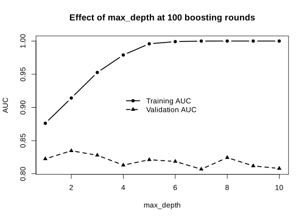{#fig-depth-r fig-alt="Line plot of training and validation AUC against max_depth from 1 to 10. Training AUC rises steadily to 1.0. Validation AUC peaks around max_depth 2, then gradually declines with some noise at higher depths."}

## Python

``` python
depth_values = list(range(1, 11))
nrounds_fixed = 100

depth_rows = []
for depth_i in depth_values:
    param_i = {"objective": "binary:logistic", "eval_metric": "auc", "eta": 0.05, "max_depth": depth_i}
    cv_fit = xgb.cv(param_i, dcv, num_boost_round=nrounds_fixed, nfold=5, seed=123, verbose_eval=False)
    last_row = cv_fit.iloc[nrounds_fixed - 1]
    depth_rows.append({"max_depth": depth_i, "train_auc": last_row["train-auc-mean"],
                        "valid_auc": last_row["test-auc-mean"]})

depth_summary = pd.DataFrame(depth_rows)
depth_summary

# --------------------------------------------------
# Plot training and validation AUC
# --------------------------------------------------
plt.figure(figsize=(7, 5))
plt.plot(depth_summary["max_depth"], depth_summary["train_auc"], marker="o", linewidth=2, label="Training AUC")
plt.plot(depth_summary["max_depth"], depth_summary["valid_auc"], marker="^", linestyle="--", linewidth=2, label="Validation AUC")
plt.xlabel("max_depth")
plt.ylabel("AUC")
plt.title("Effect of max_depth at 100 boosting rounds")
plt.legend(loc="center", frameon=False)
plt.savefig("images/06-depth-cv-py.svg")
```

```
   max_depth  train_auc  valid_auc
0          1   0.870436   0.808593
1          2   0.906350   0.819781
2          3   0.940111   0.818031
3          4   0.973645   0.811887
4          5   0.991778   0.803739
5          6   0.998685   0.796549
6          7   0.999848   0.790025
7          8   0.999985   0.781065
8          9   0.999996   0.778866
9         10   1.000000   0.780214
```

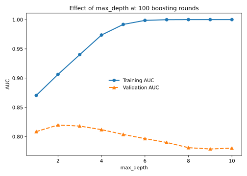{#fig-depth-py fig-alt="Line plot of training and validation AUC against max_depth from 1 to 10. Training AUC rises steadily to 1.0. Validation AUC peaks around max_depth 2 to 3, then declines at higher depths."}
:::

This shows a very clear bias-variance pattern, in both languages. As `max_depth` increases, the training AUC rises steadily and very quickly, eventually becoming almost perfect. This means that deeper trees are increasingly able to fit the training data and make very detailed corrections. In other words, increasing `max_depth` reduces bias.

However, the validation AUC behaves quite differently. It peaks early, around `max_depth = 2` to `3`, and then starts to decline as depth increases further. This means that although deeper trees continue to fit the training data better, that extra flexibility is no longer helping on unseen data. Instead, the model is starting to overfit, so variance is increasing.

So the main message here is that deeper trees are not always better. Very large values of `max_depth` allow the model to become too complex, which gives excellent training performance but worse generalization. In our case the best validation performance is at about `max_depth = 2` or `max_depth = 3`.

## `Gamma` and `min_child_weight`

`Gamma` and `min_child_weight` are two other parameters that control tree growth, but in a more data-driven way than `max_depth`. While `max_depth` gives a hard upper limit on how deep a tree is allowed to become, `gamma` and `min_child_weight` decide whether a split is worth making based on the improvement it gives and the amount of information available in the resulting nodes.

The parameter `gamma` controls how much improvement in the objective function is required before XGBoost is allowed to make a new split. If a proposed split does not improve the fit enough, the split is rejected. This means that larger values of `gamma` make the tree-growing process more conservative. In practice, increasing `gamma` can prevent the model from making small, weak, or unnecessary splits that only explain minor fluctuations in the training data.

The parameter `min_child_weight` controls how much total information, measured through the summed Hessian, must be present in a child node for the split to be accepted. In simpler terms, it prevents XGBoost from creating nodes that are supported by too little data. If a split would produce a child node with too little information, the split is not allowed. Larger values of `min_child_weight` therefore make the model more conservative and reduce the chance of creating very specific local rules.

So although both parameters restrict tree growth, they do so in different ways. `Gamma` asks whether a split improves the model enough to be worth making, while `min_child_weight` asks whether the resulting child nodes contain enough information to justify the split. In that sense, `gamma` focuses more on improvement in fit, whereas `min_child_weight` focuses more on the strength or support of the data behind the split.

From the perspective of bias and variance, increasing either of these parameters usually makes the model simpler and more stable. This can reduce overfitting, but if the values become too large, the model may become too conservative and underfit. For this reason, both `gamma` and `min_child_weight` are important tuning parameters when we want to control tree complexity without relying only on a hard depth limit.

Let's see the effect on a simple model. We are going to build a model using only a single tree and with a depth of 2 and visualize the tree.

::: panel-tabset
## R

``` r
param <- list(objective = "binary:logistic", eval_metric = "auc", max_depth = 2, eta = 0.05, gamma = 0)

set.seed(10)
model_gamma <- xgb.train(
    params = param,
    data = dcv,
    nrounds = 1,
    verbose = 0
  )

xgboost::xgb.plot.tree(model = model_gamma, tree_idx = 1)
```

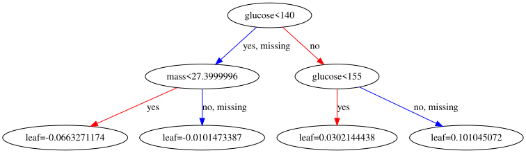{#fig-tree-gamma0-r fig-alt="A depth-2 decision tree. The root splits on glucose, the left child splits again on mass, and the right child splits again on glucose."}

## Python

``` python
param = {"objective": "binary:logistic", "eval_metric": "auc", "max_depth": 2, "eta": 0.05, "gamma": 0}

model_gamma = xgb.train(param, dcv, num_boost_round=1, verbose_eval=False)

xgb.to_graphviz(model_gamma, tree_idx=0)
```

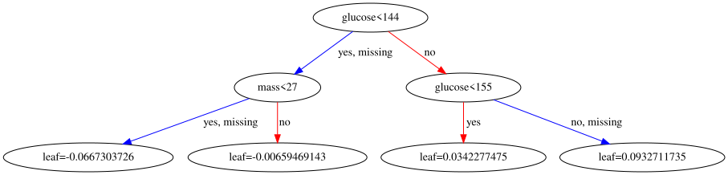{#fig-tree-gamma0-py fig-alt="A depth-2 decision tree. The root splits on glucose, the left child splits again on mass, and the right child splits again on glucose."}
:::

As you can see, the root node splits on `glucose`, and the two children split further, one on `mass` and one on `glucose` again. Looking at the gain of each split (visible in the tree, or via `xgb.model.dt.tree()` / `booster.trees_to_dataframe()`), the `mass` split has a clearly larger gain than the second `glucose` split. So let's use a `gamma` that sits between these two gains, large enough to remove the weaker split but not the stronger one.

::: panel-tabset
## R

``` r
param <- list(objective = "binary:logistic", eval_metric = "auc", max_depth = 2, eta = 0.05, gamma = 20)

set.seed(10)
model_gamma <- xgb.train(
    params = param,
    data = dcv,
    nrounds = 1,
    verbose = 0
  )

xgboost::xgb.plot.tree(model = model_gamma, tree_idx = 1)
```

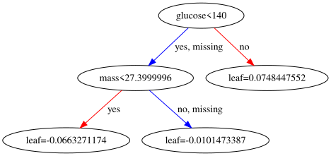{#fig-tree-gamma20-r fig-alt="The same tree with gamma set to 20. The weaker second glucose split has been pruned away, leaving a leaf, while the stronger mass split survives."}

## Python

``` python
param = {"objective": "binary:logistic", "eval_metric": "auc", "max_depth": 2, "eta": 0.05, "gamma": 20}

model_gamma = xgb.train(param, dcv, num_boost_round=1, verbose_eval=False)

xgb.to_graphviz(model_gamma, tree_idx=0)
```

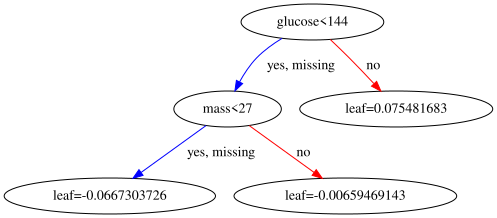{#fig-tree-gamma20-py fig-alt="The same tree with gamma set to 20. The weaker second glucose split has been pruned away, leaving a leaf, while the stronger mass split survives."}
:::

You can see that the weaker of the two second-level splits is now completely gone, replaced by a single leaf, while the stronger `mass` split is untouched. The gain for that split was simply not big enough to survive once `gamma = 20` was required.

Let's now try `min_child_weight`.

::: panel-tabset
## R

``` r
param <- list(objective = "binary:logistic", eval_metric = "auc", max_depth = 2, eta = 0.05, min_child_weight = 40)

set.seed(10)
model_cw <- xgb.train(
    params = param,
    data = dcv,
    nrounds = 1,
    verbose = 0
  )

xgboost::xgb.plot.tree(model = model_cw, tree_idx = 1)
```

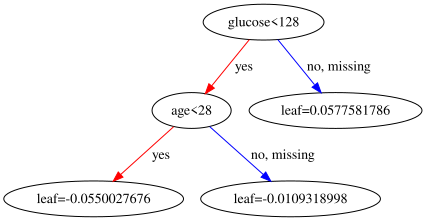{#fig-mcw-r fig-alt="The depth-2 tree refit with min_child_weight set to 40. The second-level mass split has been replaced by an age split, since mass no longer produces children with enough data support."}

## Python

``` python
param = {"objective": "binary:logistic", "eval_metric": "auc", "max_depth": 2, "eta": 0.05, "min_child_weight": 40}

model_cw = xgb.train(param, dcv, num_boost_round=1, verbose_eval=False)

xgb.to_graphviz(model_cw, tree_idx=0)
```

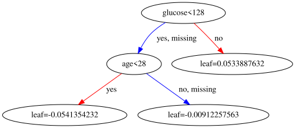{#fig-mcw-py fig-alt="The depth-2 tree refit with min_child_weight set to 40. The second-level mass split has been replaced by an age split, since mass no longer produces children with enough data support."}
:::

The result is that, in both languages, we have now replaced the `mass` split with an `age` split, which provides better-supported leaves (enough cumulative Hessian weight on both sides) at this threshold. Similar to before, these parameters can be optimized using cross-validation or similar.

::: {.callout-note}
In simple regression `min_child_weight` ≈ minimum number of samples in a leaf
:::

## L1 and L2 penalties

In addition to controlling how trees grow, XGBoost also allows us to regularize the size of the corrections that the trees add. This is done through the L1 and L2 penalties, controlled by the parameters `alpha` and `lambda`, respectively.

The parameter `lambda` corresponds to an L2 penalty. It shrinks leaf values smoothly toward zero, which makes the corrections added by each tree smaller and less aggressive.

The parameter `alpha` corresponds to an L1 penalty. Like `lambda`, it also discourages large leaf values, but it does so in a way that can shrink weak corrections much more strongly, sometimes effectively pushing them to zero.

So, in simple terms, `lambda` makes the correction factors smaller, while `alpha` can make some of the weaker correction factors disappear altogether. Increasing either of these penalties usually makes the model more conservative.

From the perspective of bias and variance, larger L1 and L2 penalties usually increase bias and reduce variance. They are therefore useful when the model is showing signs of overfitting, and they provide another way to control complexity beyond just limiting the tree structure itself.

For example you can see the effect of using a large alpha:

::: panel-tabset
## R

``` r
param <- list(objective = "binary:logistic", eval_metric = "auc", max_depth = 2, eta = 0.05, alpha = 5)

set.seed(10)
model_alpha <- xgb.train(
    params = param,
    data = dcv,
    nrounds = 1,
    verbose = 0
  )

xgboost::xgb.plot.tree(model = model_alpha, tree_idx = 1)
```

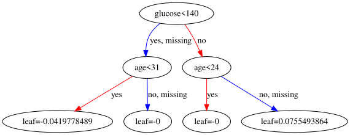{#fig-alpha-r fig-alt="A three-level tree fit with alpha=5. Two of the four leaf values have been shrunk to exactly zero by the L1 penalty."}

## Python

``` python
param = {"objective": "binary:logistic", "eval_metric": "auc", "max_depth": 2, "eta": 0.05, "alpha": 5}

model_alpha = xgb.train(param, dcv, num_boost_round=1, verbose_eval=False)

xgb.to_graphviz(model_alpha, tree_idx=0)
```

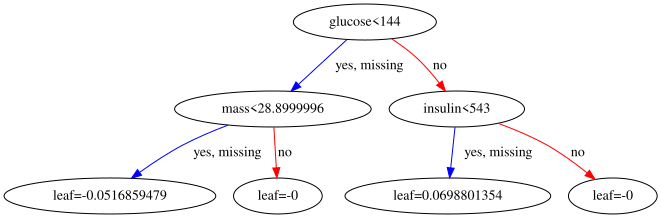{#fig-alpha-py fig-alt="A three-level tree fit with alpha=5. Some of the leaf values have been shrunk to exactly zero by the L1 penalty."}
:::

You can see that some of the correction factors (leaf values) have been set to exactly zero in both languages, so there is basically no correction at all for those portions of the data.

## `subsample` and `colsample_bytree`

Another important way to control model complexity is to add some randomness during training. In XGBoost, this is done through the parameters `subsample` and `colsample_bytree`. The purpose of these parameters is to make the model less sensitive to noise and less likely to rely too heavily on particular observations or particular variables.

The parameter `subsample` controls the fraction of training samples that are randomly used when growing each tree. For example, if `subsample = 0.8`, then each new tree is trained using only 80% of the training observations. This introduces randomness from one boosting round to the next and can help reduce overfitting, because the model is no longer allowed to look at the full dataset every time it makes a new correction.

The parameter `colsample_bytree` controls the fraction of predictor variables that are randomly available when each tree is constructed. For example, if `colsample_bytree = 0.8`, then each tree only sees 80% of the features. This reduces the chance that the model always relies on the same dominant predictors and can make the training process more robust, especially when predictors are correlated or when some variables contain noisy signal.

So basically, `subsample` adds randomness across rows, while `colsample_bytree` adds randomness across columns. Both parameters make the model less deterministic and often more robust. From the perspective of bias and variance, lowering these values usually increases bias slightly, because each tree has access to less information, but it can reduce variance and improve generalization by preventing the model from fitting noise too closely.

## `num_parallel_tree`

The parameter `num_parallel_tree` controls how many trees are grown in parallel during each boosting round. In standard XGBoost, each round usually adds one new tree, which means that the model is updated step by step with a single correction at a time. When `num_parallel_tree` is larger than 1, XGBoost grows several trees in the same round and combines their contributions before moving to the next boosting step.

This changes the behavior of the model slightly. Instead of making one correction per round, the model makes a small collection of corrections per round. In that sense, `num_parallel_tree` introduces an element that is closer to random forest style learning, especially when it is combined with parameters such as `subsample < 1` and `colsample_bytree < 1`. That is why this parameter is sometimes used to mimic or approximate boosted random forest behavior within the XGBoost framework.

In practice, `num_parallel_tree` is not one of the first parameters people usually tune in ordinary boosting applications. Most standard XGBoost models use the default value `1`, meaning one tree per boosting round. But it is useful to know that the option exists, because it shows again how flexible XGBoost is: it can behave like a classical boosting method, but it can also move somewhat toward a random-forest-like ensemble by growing multiple trees in parallel at each step.

## How to tune the parameters

A good way to tune XGBoost is to do it in stages, not all at once.

Despite that there are several ways of doing the parameter tuning i would prefer the following pipeline:

1.  Decide the task settings first.\
    For our case: `objective = "binary:logistic"` and a metric like `auc`. These define what the model is trying to do before we start adjusting model complexity.

2.  Tune the tree complexity first.\
    We start with `max_depth` and `min_child_weight`, and sometimes `gamma`. These are often the most important parameters because they decide how aggressive and local each tree can become.

3.  Then tune the randomness parameters.\
    After that, we tune `subsample` and `colsample_bytree`. These add randomness across rows and columns and often help reduce overfitting.

4.  Then tune explicit regularization if needed.\
    That means `lambda` and `alpha`. These shrink the leaf corrections and are useful when the model is still too flexible.

5.  Finally, tune `eta` together with the number of boosting rounds.\
    This part is important: `eta` and the number of rounds as said before should be thought of together, not separately. Smaller `eta` usually needs more rounds, and the clean way to choose the useful number of rounds is early stopping.

# Interpretation

A natural first step in interpretation is to ask which variables were most influential in the fitted model. In XGBoost, this is often summarized using variable importance. The idea is to quantify how much each feature contributed to the tree-building process across the ensemble.

Variable importance is a global measure. This means that it gives us an overall summary across the full model, rather than explaining one specific prediction. It can therefore help us answer questions such as: Which predictors did the model rely on most? Which variables were used often? Which ones contributed most to improving the fit?

In XGBoost, feature importance can be summarized in several ways, such as gain, cover, and frequency. Gain is often the most informative, because it reflects how much a variable improved the objective when it was used in splits. Cover relates more to how many observations were affected by those splits, and frequency counts how often the feature was used. So even though all of them are useful, they do not mean exactly the same thing.

At the same time, variable importance should be interpreted carefully. A high importance score tells us that a variable was useful for prediction, but it does not tell us the direction of effect, the shape of the relationship, or whether the variable is causally important. It is therefore a very useful starting point, but not the end of interpretation.

We can use `xgb.importance()` in R, or build the same gain/cover/frequency table from `booster.get_score()` in Python.

::: panel-tabset
## R

``` r
param <- list(objective = "reg:squarederror", eval_metric = "auc")

set.seed(10)
model <- xgb.train(
    params = param,
    data = dcv,
    nrounds = 5,
    verbose = 0
  )

xgboost::xgb.importance(model = model)
```

```
    Feature       Gain      Cover  Frequency
     <char>      <num>      <num>      <num>
1:  glucose 0.38969956 0.31710467 0.18617021
2:     mass 0.17300697 0.22327044 0.17553191
3:      age 0.11881755 0.11910377 0.11702128
4: pedigree 0.09412647 0.10568284 0.13829787
5: pressure 0.07946161 0.07564016 0.10638298
6:  triceps 0.06148347 0.05772686 0.10106383
7:  insulin 0.05476042 0.04778751 0.10106383
8: pregnant 0.02864396 0.05368374 0.07446809
```

## Python

``` python
param = {"objective": "reg:squarederror", "eval_metric": "auc"}

model = xgb.train(param, dcv, num_boost_round=5, verbose_eval=False)

gain = model.get_score(importance_type="gain")
cover = model.get_score(importance_type="cover")
freq = model.get_score(importance_type="weight")

imp = pd.DataFrame({
    "Feature": list(gain.keys()),
    "Gain": list(gain.values()),
    "Cover": [cover[k] for k in gain.keys()],
    "Frequency": [freq[k] for k in gain.keys()],
})
imp["Gain"] = imp["Gain"] / imp["Gain"].sum()
imp["Cover"] = imp["Cover"] / imp["Cover"].sum()
imp["Frequency"] = imp["Frequency"] / imp["Frequency"].sum()
imp = imp.sort_values("Gain", ascending=False).reset_index(drop=True)
imp
```

```
    Feature      Gain     Cover  Frequency
0   glucose  0.313516  0.253144   0.159204
1       age  0.131485  0.159646   0.129353
2      mass  0.128702  0.162672   0.149254
3   insulin  0.104695  0.110186   0.109453
4  pedigree  0.102665  0.137693   0.139303
5  pressure  0.085784  0.055958   0.119403
6   triceps  0.074835  0.064428   0.079602
7  pregnant  0.058318  0.056273   0.114428
```
:::

In both languages, `glucose` is clearly the most important predictor by gain, which matches the tree plots above where `glucose` was consistently the very first split.

# Categorical features

Later implementations of XGBoost can handle categorical variables more directly. However, in many workflows, and especially in older versions, the input features need to be numerical. Therefore, to use categorical variables, we first need to convert them into a numeric representation. A common way to do this in R is `model.matrix()`, and in Python `pandas.get_dummies()`, both of which create dummy/indicator columns from categorical columns. In this way, each category is translated into one or more numeric indicator columns, and the resulting matrix can then be used as input for XGBoost just like any other predictor matrix.

For example, suppose we have a dataset with both numeric and categorical predictors:

::: panel-tabset
## R

``` r
# Example data
dat_cat <- data.frame(
  age = c(45, 50, 39, 61, 47),
  bmi = c(28.1, 31.4, 24.8, 29.9, 33.2),
  sex = factor(c("female", "male", "female", "male", "female")),
  smoking = factor(c("never", "former", "current", "former", "never"))
)

dat_cat
```

```
  age  bmi    sex smoking
1  45 28.1 female   never
2  50 31.4   male  former
3  39 24.8 female current
4  61 29.9   male  former
5  47 33.2 female   never
```

## Python

``` python
dat_cat = pd.DataFrame({
    "age": [45, 50, 39, 61, 47],
    "bmi": [28.1, 31.4, 24.8, 29.9, 33.2],
    "sex": pd.Categorical(["female", "male", "female", "male", "female"]),
    "smoking": pd.Categorical(["never", "former", "current", "former", "never"]),
})

dat_cat
```

```
   age   bmi     sex  smoking
0   45  28.1  female    never
1   50  31.4    male   former
2   39  24.8  female  current
3   61  29.9    male   former
4   47  33.2  female    never
```
:::

If we try to use this data directly, the categorical variables `sex` and `smoking` are not yet in a purely numeric form. We can convert them as follows:

::: panel-tabset
## R

``` r
x_cat <- model.matrix(~ 0+. , data = dat_cat)

x_cat
```

```
  age  bmi sexfemale sexmale smokingformer smokingnever
1  45 28.1         1       0             0            1
2  50 31.4         0       1             1            0
3  39 24.8         1       0             0            0
4  61 29.9         0       1             1            0
5  47 33.2         1       0             0            1
attr(,"assign")
[1] 1 2 3 3 4 4
attr(,"contrasts")
attr(,"contrasts")$sex
[1] "contr.treatment"

attr(,"contrasts")$smoking
[1] "contr.treatment"
```

## Python

``` python
x_cat = pd.get_dummies(dat_cat, columns=["sex", "smoking"])

x_cat
```

```
   age   bmi  sex_female  sex_male  smoking_current  smoking_former  smoking_never
0   45  28.1        True     False            False           False           True
1   50  31.4       False      True            False            True          False
2   39  24.8        True     False             True           False          False
3   61  29.9       False      True            False            True          False
4   47  33.2        True     False            False           False           True
```
:::

Here, each factor/categorical variable is expanded into dummy indicator variables.

Note that R's `model.matrix(~0+., ...)` keeps one dummy column per level of `sex` but drops one level of `smoking` implicitly through `attr(,"contrasts")`-style handling of the second factor onward, whereas `pandas.get_dummies()` here keeps every level of every column (since we did not ask it to drop one). Either convention is fine for XGBoost, since tree models do not suffer from the exact collinearity that dummy-variable traps cause in linear models; just be consistent between training and prediction.

The result is now a fully numeric matrix/data frame, which can be passed to XGBoost:

::: panel-tabset
## R

``` r
x_cat <- as.matrix(x_cat)

xgb_input_cat <- xgb.DMatrix(data = x_cat)
xgb_input_cat
```

```
xgb.DMatrix  dim: 5 x 6  info: NA  colnames: yes
```

## Python

``` python
xgb_input_cat = xgb.DMatrix(x_cat.astype(float))
print(xgb_input_cat.num_row(), "x", xgb_input_cat.num_col())
```

```
5 x 7
```
:::

So, in simple terms, when categorical predictors are present, one common solution is to transform them into dummy variables first. This gives us a purely numeric matrix and makes the data compatible with the usual XGBoost workflow in either language.

# Common objective functions and sensible evaluation metrics

When using XGBoost, the `objective` tells the model what kind of problem it is trying to solve, while `eval_metric` tells us how we want to monitor performance during training. XGBoost supports many objectives, but in practice a small set covers most common use cases. Also remember that if you provide multiple evaluation metrics, XGBoost uses the last one for early stopping. These parameter names and values are identical in R and Python; only the surrounding container (a named `list()` in R, a `dict` in Python) differs.

## 1. Regression

Use these when the outcome is numerical.

-   `objective = "reg:squarederror"`\
    This is the standard choice for ordinary regression. A very natural metric is `rmse`, since it is on the same scale as the outcome and is easy to interpret. Another reasonable option is `mae` if you want a metric that is less sensitive to large errors.

-   `objective = "reg:absoluteerror"`\
    This is useful when you want training to focus on absolute errors rather than squared errors. A sensible metric here is `mae`. You can still monitor `rmse` too, but `mae` usually matches the training goal more directly.

-   `objective = "reg:squaredlogerror"`\
    This can be useful when large target values should not dominate the fit too much, or when relative errors matter more than absolute ones. The most natural metric is `rmsle`. This setup requires care because the log transformation imposes restrictions on the predictions.

-   `objective = "count:poisson"`\
    Use this for count outcomes, such as numbers of events. A sensible default metric is `poisson-nloglik`, since it matches the count-model likelihood.

-   `objective = "survival:cox"`\
    Use this for right-censored survival data when you want a Cox proportional hazards type model. A natural metric is `cox-nloglik`.

A practical starting point for most ordinary regression tasks is:

::: panel-tabset
## R

``` r
param <- list(
  objective = "reg:squarederror",
  eval_metric = "rmse"
)
```

## Python

``` python
param = {
    "objective": "reg:squarederror",
    "eval_metric": "rmse",
}
```
:::

## 2. Binary classification

Use these when the outcome has two classes, such as yes/no, case/control, or disease/no disease.

-   `objective = "binary:logistic"`\
    This is usually the best default for binary classification because it outputs probabilities. Very common metrics are `logloss` and `auc`. Use `logloss` when you care about well-calibrated probabilities, and `auc` when you mainly care about ranking positives above negatives. If you want an error rate at a fixed cutoff, you can also monitor `error`.

-   `objective = "binary:hinge"`\
    This gives hard class labels directly instead of probabilities. In that case, `error` is the most natural metric.

A strong default for most binary problems is:

::: panel-tabset
## R

``` r
param <- list(
  objective = "binary:logistic",
  eval_metric = "logloss"
)
```

## Python

``` python
param = {
    "objective": "binary:logistic",
    "eval_metric": "logloss",
}
```
:::

If class ranking is especially important, this is also common:

::: panel-tabset
## R

``` r
param <- list(
  objective = "binary:logistic",
  eval_metric = "auc"
)
```

## Python

``` python
param = {
    "objective": "binary:logistic",
    "eval_metric": "auc",
}
```
:::

## 3. Multiclass classification

Use these when there are more than two classes.

-   `objective = "multi:softprob"`\
    This is usually the most flexible choice because it returns class probabilities for all classes. The most sensible metrics are `mlogloss` and `merror`. `mlogloss` is usually better for training and early stopping because it uses the full probability information, while `merror` is easier to explain as plain misclassification rate. You must also specify `num_class`.

-   `objective = "multi:softmax"`\
    This outputs only the predicted class label, not the full class probabilities. A natural metric here is `merror`. This is fine if you only care about the final class call, but `multi:softprob` is often more useful in practice because you can still convert probabilities to class labels later.

A good default is:

::: panel-tabset
## R

``` r
param <- list(
  objective = "multi:softprob",
  eval_metric = "mlogloss",
  num_class = 3
)
```

## Python

``` python
param = {
    "objective": "multi:softprob",
    "eval_metric": "mlogloss",
    "num_class": 3,
}
```
:::

## 4. Ranking

Use these when the goal is to rank items rather than predict a simple class or number, such as search results or recommendation lists.

-   `objective = "rank:ndcg"`\
    A natural metric is `ndcg`.

-   `objective = "rank:map"`\
    A natural metric is `map`.

-   `objective = "rank:pairwise"`\
    This is another common ranking objective, often monitored with `ndcg` or `map` depending on the problem.

## A simple rule of thumb

A good practical rule is: choose an `eval_metric` that matches the thing you truly care about on unseen data.

-   If you care about average prediction error in regression, use `rmse` or `mae`.
-   If you care about probability quality in classification, use `logloss` or `mlogloss`.
-   If you care about ranking positives above negatives, use `auc`.
-   If you care about plain classification accuracy, use `error` or `merror`, but be careful because these can hide important problems such as class imbalance.

# Summary of the full workflow

In this chapter, we have gone through the main practical steps needed to use XGBoost for a real prediction problem.

A practical XGBoost analysis usually follows this general pipeline:

1.  Inspect the data\
    Start by understanding the dataset, the variables, the outcome, the data types, and any missing values or categorical predictors that may need special handling.

2.  Prepare predictors and outcome\
    Convert the response into the format needed for the chosen objective, and make sure the predictors are represented in a form suitable for XGBoost, usually as a numeric matrix or an appropriate data structure.

3.  Split the data\
    Set aside a final test set that will remain untouched until the end. Use the remaining data for model development, validation, and cross-validation.

4.  Create a DMatrix\
    Convert the predictors and labels into `xgb.DMatrix` (R) or `xgboost.DMatrix` (Python) objects, which are the data containers XGBoost uses for efficient training and prediction.

5.  Fit an initial model\
    Start with a simple model using a small set of essential parameters, such as the objective and evaluation metric, to establish a baseline.

6.  Monitor training\
    Use a watchlist to follow performance on the training and validation sets across boosting rounds. This helps reveal whether the model is learning useful structure or beginning to overfit.

7.  Use cross-validation and early stopping\
    Rather than relying on one split alone, use cross-validation to obtain a more stable estimate of predictive performance. Early stopping can be used to choose the effective number of boosting rounds automatically.

8.  Tune important parameters\
    Adjust the main complexity and regularization parameters, such as `max_depth`, `min_child_weight`, `eta`, `subsample`, and `colsample_bytree`, to find a better balance between bias and variance.

9.  Refit on the full development data\
    Once a suitable parameter combination has been chosen, fit the final model on all non-test data so that it uses as much information as possible before final evaluation.

10. Evaluate on the untouched test set\
    Only at the end should the final model be assessed on the test data. This gives the most honest estimate of how well the model is likely to perform on unseen observations.

11. Interpret the fitted model\
    Finally, examine variable importance, partial dependence, SHAP values, or other interpretation tools to understand which variables matter and how they influence the predictions.

# Practical warnings and common pitfalls

Although XGBoost is a powerful and flexible method, it is still easy to misuse if we are not careful. A few practical warnings are therefore worth keeping in mind.

First, the test set should not be used during tuning. The test set is meant to represent completely unseen data and should only be used once the model-building process is finished. If we repeatedly look at test-set performance while choosing parameters, then the test set is no longer acting as a true external check, and the final performance estimate may become too optimistic.

Second, very high training performance does not automatically mean that the model is good. In XGBoost, it is often easy to obtain a training AUC that is extremely high, even close to perfect, especially when the trees are deep or the number of rounds is large. But the real question is how well the model performs on unseen data. A large gap between training and validation performance is often a sign of overfitting.

Third, variable importance should not be confused with causality. A variable may be very useful for prediction without being causally responsible for the outcome. Importance scores simply tell us that the variable helped the model reduce prediction error. They do not prove that changing that variable would change the outcome.

Fourth, AUC alone is not enough. AUC is a very useful summary of class separation, but it does not tell us everything. In practical applications, we may also care about calibration, classification thresholds, sensitivity, specificity, precision, recall, or other measures depending on the goal of the analysis. A model can have a good AUC and still be unsatisfactory in other important ways.

Fifth, correlated predictors can complicate interpretation. When several variables carry similar information, XGBoost may split on one of them in one tree and another one in a different tree. As a result, variable importance may be spread across correlated predictors, and interpretation tools such as PDPs or SHAP summaries may be harder to interpret cleanly.

Finally, small datasets can make tuning unstable. In very small samples, the estimated performance may depend strongly on the exact split or fold assignment, and the selected tuning parameters may vary considerably from run to run. In such settings, cross-validation is still useful, but the results should be interpreted with extra caution.

So, while XGBoost is powerful, good practice still matters. The model should be trained, tuned, and interpreted with care, and the final conclusions should always be based on validation and test performance rather than training performance alone.
